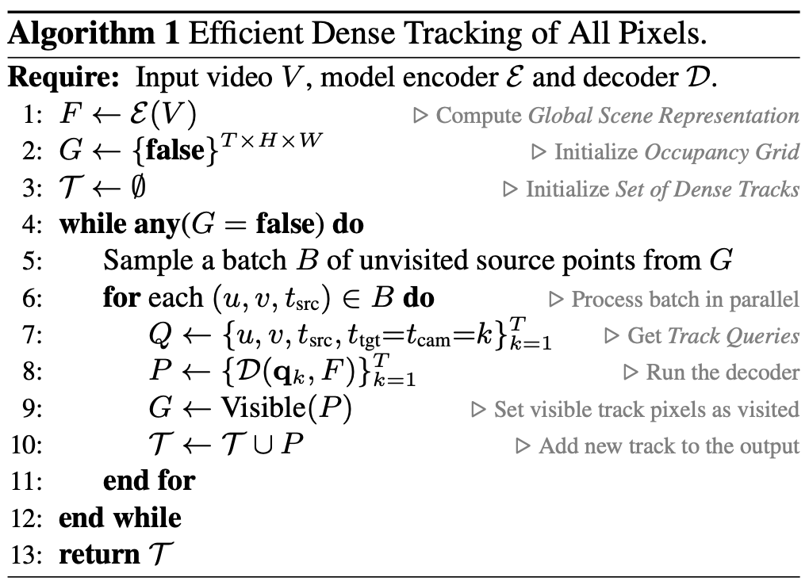
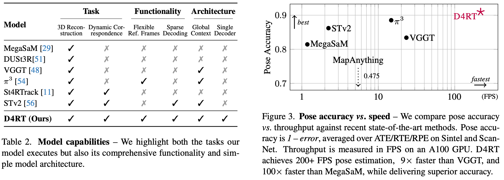

# 2 2025 D4RT: Dynamic 4D Reconstruction and Tracking 

- [DeepMind: Efficiently Reconstructing Dynamic Scenes One D4RT at a Time](https://arxiv.org/pdf/2512.08924)

- We refer to the project webpage for animated results: https://d4rt-paper.github.io

## Abstract

- Understanding and reconstructing the complex geometry and motion of dynamic scenes from video remains a formidable challenge in computer vision. 
    - This paper introduces D4RT, a simple yet powerful **feedforward model** designed to efficiently solve this task. 
    - D4RT utilizes a unified **transformer architecture** to jointly infer depth, spatiotemporal correspondence, and full camera parameters from a single video. 
    - Its core innovation is a novel querying mechanism that sidesteps the heavy computation of dense, per-frame decoding and the complexity of managing multiple, task-specific decoders. 
    - Our decoding interface allows the model to independently and flexibly probe the 3D position of any point in space and time. 
    - The result is a lightweight and highly scalable method that enables remarkably efficient training and inference. We demonstrate that our approach sets a **new state of the art, outperforming previous methods across a wide spectrum of 4D reconstruction tasks.**

## 1. Introduction

- Traditional 3D reconstruction asks: ‘What is the geometry of everything, everywhere, all at once?’ 
    - We argue this exhaustive, rigid approach is fundamentally ill-equipped for a dynamic world. 
    - Despite the clear need for unified 4D understanding, leading approaches often tackle the problem by dividing it into discrete, task-specific components.
        - For instance, `MegaSaM` relies on a complex mosaic of off-the-shelf models to separately estimate mono-depth, metric depth, and motion segmentation. Fusing these disparate signals requires **computationally expensive test-time optimization to enforce geometric consistency**. 
        - **Recent feedforward approaches such as [VGGT (Meta AI)](https://arxiv.org/pdf/2503.11651) employ separate, specialized decoders for distinct modalities.** 
    - Crucially, neither of these methods is capable of establishing correspondences for dynamic portions of the scene. 
    - While `SpatialTrackerV2` incorporates dynamics, it still lacks a unified, single-stage formulation, instead relying on **costly iterative refinement.**

- We propose shifting the paradigm from fragmented, frame-level decoding to efficient, on-demand querying. 
    - We introduce D4RT, a feedforward method leveraging a flexible and scalable architecture to achieve full 4D reconstruction. 
    - As shown in Fig. 1, our model first encodes the input video, generating a latent scene representation which is then used to independently decode any number of spatiotemporal point queries. 
    - **This simple, novel design unifies all 4D reconstruction tasks into a single interface and unlocks efficient training and inference.**

- Our key contributions are as follows:
    - We propose D4RT, a novel method for efficient feedforward querying of point-level 4D scene information captured in a video.
    - We demonstrate how our unified approach unlocks 4D correspondence, point clouds, depth maps, and camera parameters for both static and dynamic scenes through a single interface.
    - **In an extensive set of experiments, we show that D4RT sets a new state of the art in Dynamic 4D Reconstruction and Tracking while outperforming existing approaches in both speed and accuracy.**
    - Finally, we demonstrate how our flexible decoder unlocks an efficient algorithm to track all pixels in a video, enabling dense, holistic scene reconstruction.

## 2. Method

- D4RT is based on a simple **encoder-decoder architecture** inspired by the [Scene Representation Transformer (Google Research)](https://arxiv.org/pdf/2111.13152)

- As shown in Fig. 2, the video is first processed by a **powerful encoder** producing the Global Scene Representation $F$.
    - The role of the encoder is to capture information about the full environment, identifying dense correspondence across all video frames, as well as understanding the flow of time and its effect on the scene. 
- In a second stage, a **lightweight decoder** queries $F$ through a simple low-level interface.
    - Specifically, **given a 2D point in a source frame, the decoder predicts the 3D position of the point** 
        - at a given target timestep (defining the temporal state) 
        - and expressed relative to a given camera reference (defined by the frame timestep where the camera viewpoint corresponds to this reference).

- We draw attention to three desirable properties of this formulation: 
    - first, the indices need not coincide, allowing a full disentanglement of space and time; 
    - second, each query is decoded independently, allowing for both efficient training and inference as well as flexible decoding (both sparse and dense); 
    - and third, this interface unlocks a suite of down stream applications in a unified, consistent manner (Tab. 1).

### 2.1. D4RT Framework

- Given a video $V\in R^{T\times H\times W \times 3}$, the encoder $E$ extracts the latent Global Scene Representation

$$ F = E(V) \in R^{N\times C} $$

- where:
    - $N$: number of [ViT patches](https://arxiv.org/pdf/2010.11929) in the video
    - $C$: **patch embedding** dimension (number of channels)

- Once $F$ is calculated, it remains fixed throughout the second stage, where the decoder $D$ cross-attends from any number of queries into $F$. 
    - We define a query 
    
    $$ q = (u, v, t_{src}, t_{tgt}, t_{cam}) $$
    
    - where $(u, v, t_{src})$ correspond to source parameters and $(t_{tgt}, t_{cam})$ correspond to target parameters.
    - Here, $(u, v) \in [0, 1]^2$ represent the **normalized 2D coordinates** of a point of interest in the source frame $t_{src}$
    - while $(t_{tgt}, t_{cam}) \in [1, ... , T]^2$ denote the temporal indices of the target timestep and the reference camera coordinate system (illustrated in Fig. 2). 
        - Note: we don't tell the model the 3D coordinates / orientations of the camera, but "the same camera state as time $t$ in the video"
    - Each query $q$ is processed fully independently with the video features $F$ to produce its corresponding 3D point position 
    $P$:
    
    $$ P = D(q, F) \in R^3 $$

- From query to 4D reconstruction. Through a simple variation of queries, our framework allows us to address a broad range of 4D tasks as shown in Tab. 1. 
    - Choosing any fixed point $(u, v)$ from a source frame $t_{src}$ in the video while varying $t_{tgt} = t_{cam} = \{1 ... T\}$ produces its **point track**, the 3D trajectory of the corresponding point throughout the video.
    - For full **point cloud** reconstruction, the 3D position of all pixels in the video can be directly predicted in a shared reference frame $t_{cam}$ by the model. This alleviates the need for coordinate transformations to map pixels from different video frames into a unified coordinate system using explicit, potentially noisy camera estimates. 
    - **Depth maps** can be recovered by simply querying any pixel in the video with $t_{src} = t_{tgt} = t_{cam}$ and only keeping the Z-dimension of the output $P$.

- We next detail how camera extrinsics and intrinsics predictions are obtained. 
    - To derive the relative camera pose between any pair of video frames $i, j \in [1 ... T]$, we create queries for an ensemble of source points $\{(u_k, v_k)\}_k$ sampled on a $(h, w)$ grid in both reference frames:
    
    $$ q_{i,k} = (u_k, v_k, i, i, i), \quad q_{j,k} = (u_k, v_k, i, i, j) $$

    - The resulting sets $\{D(q_{i,k}, F)\}_k$ and $\{D(q_{j,k}, F)\}_k$ describe the same 3D points in different reference frames. 
    - We therefore only need to find the rigid transformation between them, which can be efficiently derived through Umeyama’s algorithm that solves a $3\times 3$ SVD decomposition.
    
- To recover intrinsics for video frame $i \in [1 ... T]$, we construct a set of queries for different source points, again sampled on a $(h, w)$ grid. 
    - We decode all corresponding 3D positions $P = (p_x, p_y, p_z)$. 
    - Assuming a pinhole camera model with a principal point at $(0.5, 0.5)$, we get focal length parameters as follows:

    $$ f_x=p_z(u − 0.5)/p_x, \quad f_y=p_z(v − 0.5)/p_y $$

    - We take the median over the $k$ estimates for robustness.
    - Camera models with distortion (e.g., fisheye) can also be seamlessly incorporated by adding a non-linear refinement step on top of the initial estimation

### 2.2. Model Architecture

- Our encoder $E$ is based on the **Vision Transformer** with interleaved local frame-wise, and global self-attention layers. 
    - For simplicity, and to support arbitrary aspect ratios, we resize the input video to a fixed square resolution before tokenizing it. 
    - To incorporate the original aspect ratio, we embed it into a separate token and pass it to the transformer along with the main video tokens.

- Pointwise decoder. 
    - The decoder $D$ is a **small cross attention transformer**. 
    - A query token is first constructed by adding the [**Fourier feature embedding (a type of position embedding)**](https://arxiv.org/pdf/2006.10739) of the 2D coordinates $(u, v)$ to the **learned discrete timestep embeddings** for $t_{src}, t_{tgt}, t_{cam}$. 
    - We empirically observe that augmenting the query with an embedding of the local $9\times 9$ pixel RGB patch centered at $(u, v)$ dramatically improves performance, see Sec. 4.4.
    - Each query is decoded independently through cross attention into the Global Scene Representation $F$, ensuring that queries do not interact. 
    - The resulting output feature is then mapped to a 3D point position $P$ via a simple learned projection. 
    - Decoding queries independently is a deliberate design decision with major advantages. 
        - It allows efficient training, as only a small number of queries need to be decoded to provide a supervision signal to the model. 
        - Equally importantly, at inference time, the queries can be chosen freely across all video frames as described in Sec. 2.3, and need not be correlated to each other to avoid out-of-distribution effects – indeed, we have empirically observed major performance drops when enabling self-attention between queries in early experiments.
        - Finally, this design allows highly efficient inference thanks to its trivial parallelism. 
        - As shown in Fig. 3 and Tab. 3, we obtain the best trade-off between performance and latency across multiple tasks.

### 2.3. Training and Inference

- The model is implemented in [Kauldron](https://github.com/google-research/kauldron) and trained **end-to-end** by minimizing the weighted sum of losses computed over a batch of $N$ sampled queries. 
    - The primary supervision signal is derived from an $L_1$ loss applied to the normalized 3D point position $P$. 
    - Specifically, both the target and the estimated point sets are normalized by their respective mean depths and then passed through the transform $\text{sign}(x) \cdot \log(1+|x|)$ to dampen the influence of far-away points on the loss. 
    - We also supervise a set of auxiliary predictions from additional linear projections on the decoder output: 
        - An $L_1$ loss on 2D coordinates of the point positions in image space; 
        - cosine similarity for 3D surface normals; 
        - binary cross-entropy for target point visibility; 
        - and $L_1$ on the vector of point motion. 
        - All loss terms are applied only where ground truth supervision is available.
    - We finally incorporate a confidence penalty – $\log(c)$ where $c$ additionally weights the 3D point error.

- Efficient dense dynamic correspondence. 
    - A key capability of our query-based model is that it can efficiently compute dense correspondences for all pixels in a video, both static and dynamic. 
    - As shown in Fig. 4, this capability is crucial for building a complete, holistic scene reconstruction, which in turn is key to eliminating the occlusion induced discontinuities and sparse artifacts common in prior works. 
    - However, a naive approach to reconstruct tracks for all pixels across the video would involve $O(T^2HW)$ queries, the majority of which are not required.
    - We introduce Alg. 1 which exploits spatio-temporal redundancy using an occupancy grid $G \in \{0, 1\}^{T\times H\times W}$ to speed this procedure up significantly. 
    - The algorithm only initiates new tracks from unvisited pixels. Each full video track marks all spatio-temporal pixels it visibly passes through as visited. 
    - Empirically, we find that this yields an adaptive speedup between $5–15\times$ depending on the motion complexity in the video. 
    - This dense, flexible strategy is feasible for our method precisely because our decoder is both sparse, and lightweight. 
    - It is notable that prior works are ill-suited for this task for various reasons. Most methods fail to provide any correspondences for dynamic portions of the scenes, dense frame-level decoding remains locked in the costly naive approach, and models with heavy sparse decoders face a large per-query cost.

## 3. Related Work

- Classical approaches to 3D reconstruction are fundamentally anchored in multi-view geometry, specifically Structure-from-Motion (SfM) and Multi-View Stereo (MVS). 
    - The standard pipeline exemplified by COLMAP incrementally estimates and optimizes sparse geometry and camera poses. 
    - The advantage of these methods is their explicit enforcement of geometric consistency and mathematically interpretable reconstructions.
    - However, they are computationally intensive and brittle.

### 3.1. Feedforward 3D Reconstruction

- The field of 3D reconstruction has recently shifted towards end-to-end, feedforward models that directly infer geometry from images. 
    - The seminal work [DUSt3R](https://arxiv.org/pdf/2312.14132) demonstrated that Transformer-based networks can perform 3D reconstruction from unposed and uncalibrated image pairs in an end-to-end approach. 
    - [VGGT](https://arxiv.org/pdf/2503.11651) later scaled this approach beyond pairs by using a **Vision Transformer** with global attention. 
    - Building on this feedforward paradigm, several works have extended the methodology to dynamic videos and more efficient inference. 
    
- However, these models share significant limitations. 
    - For instance, many do not support changing camera intrinsics within a video, and several are restricted to using only the first frame as the camera reference. 
    - More importantly, architectures inspired by VGGT either use separate decoder heads for each task (e.g., depth, pose, point cloud), or they incorporate separate models for sub-tasks of 4D reconstruction, making the full pipeline cumbersome and computationally expensive to run. 
    - Finally, these methods are not directly capable of providing correspondences for dynamic regions of the scene.

### 3.2. From 2D to 3D Point Tracking

- The task of point tracking aims to establish long-term 2D correspondences through challenges like occlusions and non-rigid motion, evolving from early methods such as Particle Video to newer deep-learning approaches. 
    - This field has further progressed from tracking a sparse set of points to the dense tracking of every pixel in a video. 
    - A parallel line of work has explored lifting these 2D tracks into 3D, which is achieved by project ing tracks from image space to camera coordinates using ground truth or predicted depth and camera intrinsics.
    - Most recently, models like SpatialTracker, L4P, DPM and St4RTracker have moved to directly predicting 3D tracks without priors. 
    - Yet, limitations remain: 
        - St4RTracker and DPM follow the pairwise paradigm of DUSt3R, preventing holistic video processing. 
        - SpatialTrackerV2 is a multi-stage approach and exhibits slow inference speeds as it relies on iterative refinements. 
        - Meanwhile, L4P requires different heads for sparse and dense outputs of the same nature (e.g., flow vs. 2D tracking or depth vs. 3D tracking). 
    - In contrast, our approach unifies these tasks within a single architecture. Tab. 2 summarizes capabilities across a recent set of state-of-the-art models.

## 4. Experiments

## 5. Conclusion

- In this work, we introduce D4RT, a simple yet highly scalable feedforward network that reconstructs dynamic 4D scenes with temporal correspondence. 
    - **Our core innovation is an efficient, query-based decoder that allows for the independent prediction of any point’s 3D position in space and time.** 
    - This flexible parametrization avoids the computational bottlenecks of dense per-frame decoders, enabling inference that scales linearly with the number of points to be reconstructed. 
    - **Crucially, we demonstrate that D4RT achieves state-of-the-art results across a wide range of 4D tasks including depth, point cloud estimation, and 3D point tracking.** 
    - D4RT demonstrates that scaling to complex, dynamic environments does not require sacrificing precision, offering a unified framework for the next generation of 4D perception.

