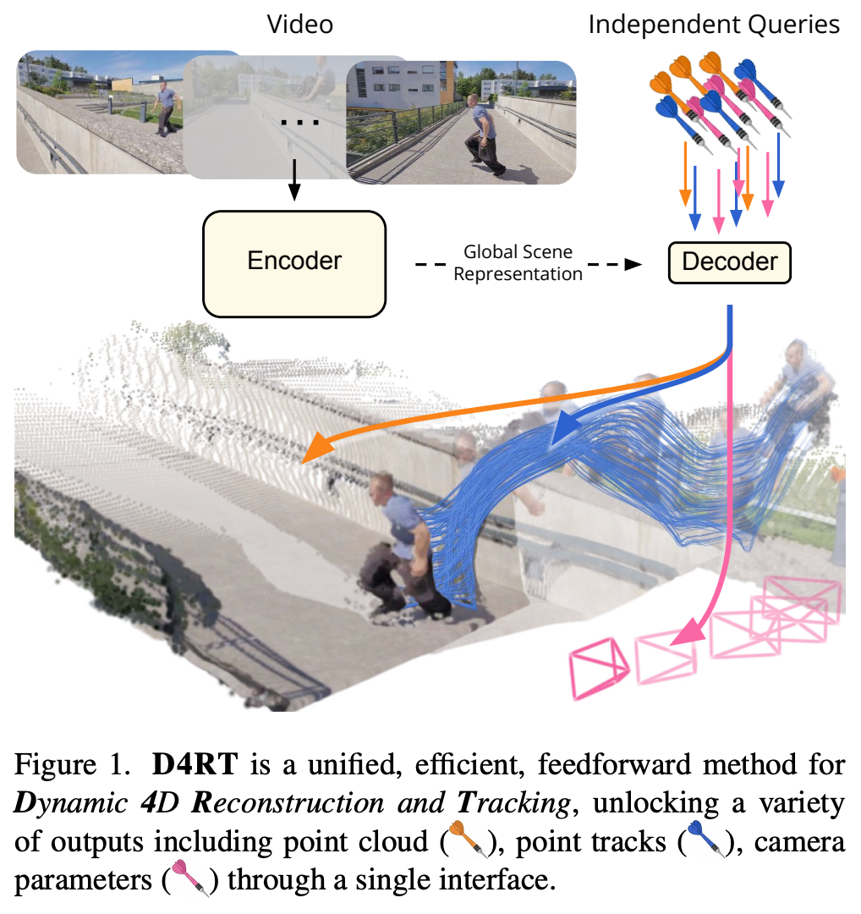
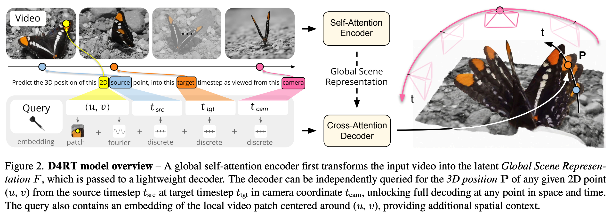
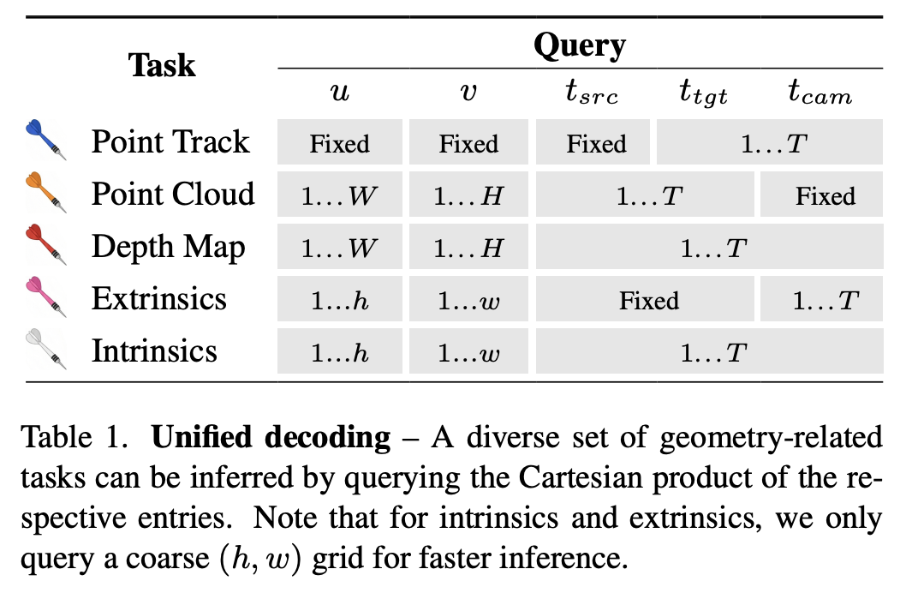

# 2 2025 D4RT: Dynamic 4D Reconstruction and Tracking 

- [DeepMind: Efficiently Reconstructing Dynamic Scenes One D4RT at a Time](https://arxiv.org/pdf/2512.08924)

- We refer to the project webpage for animated results: https://d4rt-paper.github.io

## Abstract

- Understanding and reconstructing the complex geometry and motion of dynamic scenes from video remains a formidable challenge in computer vision. 
    - This paper introduces D4RT, a simple yet powerful **feedforward model** designed to efficiently solve this task. 
    - D4RT utilizes a unified **transformer architecture** to jointly infer depth, spatiotemporal correspondence, and full camera parameters from a single video. 
    - Its core innovation is a novel querying mechanism that sidesteps the heavy computation of dense, per-frame decoding and the complexity of managing multiple, task-specific decoders. 
    - Our decoding interface allows the model to independently and flexibly probe the 3D position of any point in space and time. 
    - The result is a lightweight and highly scalable method that enables remarkably efficient training and inference. We demonstrate that our approach sets a **new state of the art, outperforming previous methods across a wide spectrum of 4D reconstruction tasks.**

## 1. Introduction

- Traditional 3D reconstruction asks: ‘What is the geometry of everything, everywhere, all at once?’ 
    - We argue this exhaustive, rigid approach is fundamentally ill-equipped for a dynamic world. 
    - Despite the clear need for unified 4D understanding, leading approaches often tackle the problem by dividing it into discrete, task-specific components.
        - For instance, `MegaSaM` relies on a complex mosaic of off-the-shelf models to separately estimate mono-depth, metric depth, and motion segmentation. Fusing these disparate signals requires **computationally expensive test-time optimization to enforce geometric consistency**. 
        - **Recent feedforward approaches such as [VGGT (Meta AI)](https://arxiv.org/pdf/2503.11651) employ separate, specialized decoders for distinct modalities.** 
    - Crucially, neither of these methods is capable of establishing correspondences for dynamic portions of the scene. 
    - While `SpatialTrackerV2` incorporates dynamics, it still lacks a unified, single-stage formulation, instead relying on **costly iterative refinement.**

- We propose shifting the paradigm from fragmented, frame-level decoding to efficient, on-demand querying. 
    - We introduce D4RT, a feedforward method leveraging a flexible and scalable architecture to achieve full 4D reconstruction. 
    - As shown in Fig. 1, our model first encodes the input video, generating a latent scene representation which is then used to independently decode any number of spatiotemporal point queries. 
    - **This simple, novel design unifies all 4D reconstruction tasks into a single interface and unlocks efficient training and inference.**

- Our key contributions are as follows:
    - We propose D4RT, a novel method for efficient feedforward querying of point-level 4D scene information captured in a video.
    - We demonstrate how our unified approach unlocks 4D correspondence, point clouds, depth maps, and camera parameters for both static and dynamic scenes through a single interface.
    - **In an extensive set of experiments, we show that D4RT sets a new state of the art in Dynamic 4D Reconstruction and Tracking while outperforming existing approaches in both speed and accuracy.**
    - Finally, we demonstrate how our flexible decoder unlocks an efficient algorithm to track all pixels in a video, enabling dense, holistic scene reconstruction.

## 2. Method

- D4RT is based on a simple **encoder-decoder architecture** inspired by the [Scene Representation Transformer (Google Research)](https://arxiv.org/pdf/2111.13152)

- As shown in Fig. 2, the video is first processed by a **powerful encoder** producing the Global Scene Representation $F$.
    - The role of the encoder is to capture information about the full environment, identifying dense correspondence across all video frames, as well as understanding the flow of time and its effect on the scene. 
- In a second stage, a **lightweight decoder** queries $F$ through a simple low-level interface.
    - Specifically, **given a 2D point in a source frame, the decoder predicts the 3D position of the point** 
        - at a given target timestep (defining the temporal state) 
        - and expressed relative to a given camera reference (defined by the frame timestep where the camera viewpoint corresponds to this reference).

- We draw attention to three desirable properties of this formulation: 
    - first, the indices need not coincide, allowing a full disentanglement of space and time; 
    - second, each query is decoded independently, allowing for both efficient training and inference as well as flexible decoding (both sparse and dense); 
    - and third, this interface unlocks a suite of down stream applications in a unified, consistent manner (Tab. 1).

### 2.1. D4RT Framework

- Given a video $V\in R^{T\times H\times W \times 3}$, the encoder $E$ extracts the latent Global Scene Representation

$$ F = E(V) \in R^{N\times C} $$

- where:
    - $N$: number of [ViT patches](https://arxiv.org/pdf/2010.11929) in the video
    - $C$: **patch embedding** dimension (number of channels)

- Once $F$ is calculated, it remains fixed throughout the second stage, where the decoder $D$ cross-attends from any number of queries into $F$. 
    - We define a query 
    
    $$ q = (u, v, t_{src}, t_{tgt}, t_{cam}) $$
    
    - where $(u, v, t_{src})$ correspond to source parameters and $(t_{tgt}, t_{cam})$ correspond to target parameters.
    - Here, $(u, v) \in [0, 1]^2$ represent the **normalized 2D coordinates** of a point of interest in the source frame $t_{src}$
    - while $(t_{tgt}, t_{cam}) \in [1, ... , T]^2$ denote the temporal indices of the target timestep and the reference camera coordinate system (illustrated in Fig. 2). 
        - Note: we don't tell the model the 3D coordinates / orientations of the camera, but "the same camera state as time $t$ in the video"
    - Each query $q$ is processed fully independently with the video features $F$ to produce its corresponding 3D point position 
    $P$:
    
    $$ P = D(q, F) \in R^3 $$

- From query to 4D reconstruction. Through a simple variation of queries, our framework allows us to address a broad range of 4D tasks as shown in Tab. 1. 
    - Choosing any fixed point $(u, v)$ from a source frame $t_{src}$ in the video while varying $t_{tgt} = t_{cam} = \{1 ... T\}$ produces its **point track**, the 3D trajectory of the corresponding point throughout the video.
    - For full **point cloud** reconstruction, the 3D position of all pixels in the video can be directly predicted in a shared reference frame $t_{cam}$ by the model. This alleviates the need for coordinate transformations to map pixels from different video frames into a unified coordinate system using explicit, potentially noisy camera estimates. 
    - **Depth maps** can be recovered by simply querying any pixel in the video with $t_{src} = t_{tgt} = t_{cam}$ and only keeping the Z-dimension of the output $P$.

