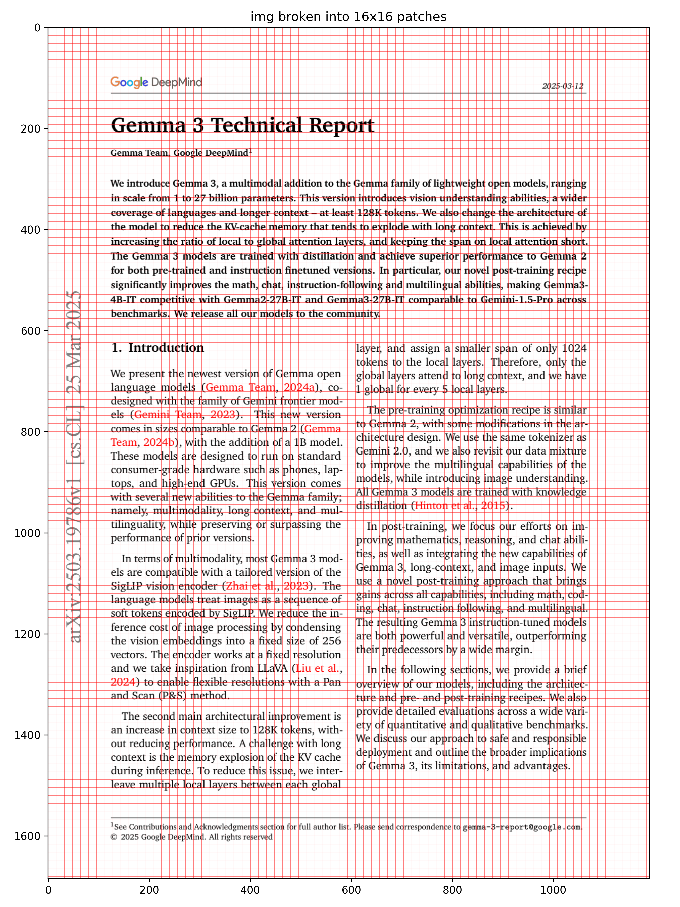
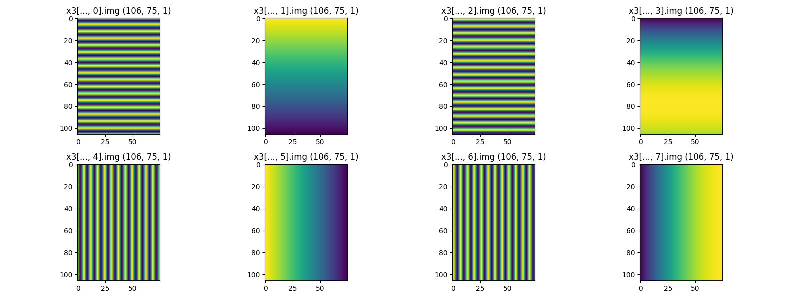

# 1 Embeddings

```python
import jax.numpy as jnp
from flax import nnx
from jax import Array

from neu_ai.plot import plot1, plot_img_patches
from neu_ai.utils import read_pdf


class PatchEmbed(nnx.Module):
    def __init__(s, patch_size, d_embed, rngs, n_channel=3):
        s.conv = nnx.Conv(
            in_features=n_channel,
            out_features=d_embed,
            kernel_size=(patch_size, patch_size),
            strides=(patch_size, patch_size),
            rngs=rngs,
        )

    def __call__(s, x):
        # x: (batch, height, width, n_channel)
        return s.conv(x)


def mid_split(x: Array):
    mid = x.shape[-1] // 2
    return x[..., :mid], x[..., mid:]


class RoPE1D(nnx.Module):
    def __init__(s, d, T, base=1e4):
        wt = s.wt(T, s.omega(base, d))
        # We repeat the frequencies so they match the shape of the features
        wt = jnp.concat([wt, wt], axis=-1)
        s.cos, s.sin = jnp.cos(wt), jnp.sin(wt)

    def omega(s, base, d):
        # We only need d/2 frequencies because they apply to pairs
        return 1.0 / (base ** (jnp.arange(0, d, 2) / d))

    def wt(s, T, omega):
        return jnp.outer(jnp.arange(T), omega)

    def rotate_x(s, x):
        x1, x2 = mid_split(x)
        return jnp.concat([-x2, x1], axis=-1)

    def __call__(s, x: Array):
        # x: (batch, seq_len, n_head, d_head)
        _, T, _, _ = x.shape
        # Reshape for broadcasting over heads
        cos = s.cos[None, :T, None, :]
        sin = s.sin[None, :T, None, :]
        # Apply the "Rotary" transformation:
        # (x1, x2) -> (x1*cos - x2*sin, x1*sin + x2*cos)
        # We use a trick: [x1, x2] -> [-x2, x1]
        return x * cos + s.rotate_x(x) * sin


class RoPE2D(RoPE1D):
    def __init__(s, d, H, W, base=1e4):
        # We split 'dim' into two parts: half for H, half for W
        # Each axis needs its own d/2 dimensions (so d/4 pairs each)
        omega = s.omega(base, d // 2)
        wt_H = s.wt(H, omega)
        wt_W = s.wt(W, omega)
        # Broadcast to 2D grid: (H, W, d/4)
        wt_H = jnp.tile(wt_H[:, None, :], (1, W, 1))
        wt_W = jnp.tile(wt_W[None, :, :], (H, 1, 1))
        # Concatenate H and W frequencies along the feature dimension
        # Total feature dim: (H, W, d/4) -> (H, W, d)
        wt = jnp.concat([wt_H, wt_H, wt_W, wt_W], axis=-1)
        s.cos, s.sin = jnp.cos(wt), jnp.sin(wt)

    def __call__(s, x: Array):
        # x: (batch, H, W, n_head, d_head)
        _, H, W, _, _ = x.shape
        cos = s.cos[None, :H, :W, None, :]
        sin = s.sin[None, :H, :W, None, :]
        x1, x2 = mid_split(x)
        x_rotated = jnp.concat([s.rotate_x(x1), s.rotate_x(x2)], axis=-1)
        return x * cos + x_rotated * sin


def main():
    path = "../papers/2025-03-12_Gemma_3_Technical_Report.pdf"
    pages = read_pdf(path, range(3))
    img, txt = pages[0]

    patch_size, d_embed, rngs = 16, 8, nnx.Rngs(0)
    patch_embed = PatchEmbed(patch_size, d_embed, rngs)
    rope2d = RoPE2D(d_embed, H=200, W=200)

    x0 = jnp.array([img])
    x1 = patch_embed(x0)
    x2 = rope2d(jnp.ones_like(x1[:, :, :, None, :]))
    x3 = x2.squeeze()

    print(f"""
img: {x0.shape}
after PatchEmbed: {x1.shape}
after RoPE2D: {x2.shape}
    """)
    plot_img_patches(img, patch_size, "PatchEmbed")

    plots = {}
    for i in range(d_embed):
        plots[f"x3[..., {i}].img"] = x3[..., [i]]
    plot1(plots, "RoPE2D", C=d_embed // 2)


if __name__ == "__main__":
    main()

```

- This code implements the core architectural components for processing visual data in a transformer, specifically focusing on **Patch Embedding** and **Rotary Positional Embeddings (RoPE)** extended into two dimensions.

## 1. Patch Embedding: The Vision Transformer Entryway



- In Vision Transformers (ViTs), images must be converted into a sequence of vectors. The `PatchEmbed` class does this using a **2D Convolution**.

- Mathematical Mechanism
    - Instead of manually cutting the image, we use a convolution where the `kernel_size` and `stride` are equal to the `patch_size`. 
    - **Input:** Image $x \in \mathbb{R}^{H \times W \times C}$
    - **Operation:** $x_{patched} = \text{Conv2d}(x)$
    - **Result:** If the image is $224 \times 224$ and `patch_size` is $16$, the output grid is $14 \times 14$. Each "pixel" in this $14 \times 14$ grid is a vector of size `d_embed` representing a specific patch.


## 2. Theory of Rotary Positional Embeddings (RoPE)

- Transformers are inherently permutation-invariant (they don't know the order of tokens). RoPE is a method to inject positional information by **rotating** the feature vectors in a complex plane.

### The 1D Mechanism

- RoPE represents the embedding vector as a set of pairs. For a pair of values $(x_1, x_2)$ at position $m$, we apply a rotation matrix:

$$
\begin{pmatrix} x^{(m)}_1 \\ x^{(m)}_2 \end{pmatrix} \rightarrow \begin{pmatrix} \cos m\theta & -\sin m\theta \\ \sin m\theta & \cos m\theta \end{pmatrix} \begin{pmatrix} x_1 \\ x_2 \end{pmatrix}
$$

- **Key Property:** The dot product between two rotated vectors depends only on their **relative distance** $(m - n)$. This allows the model to learn spatial relationships naturally.

### Extending to 2D



- For images, we have two coordinates: $(i, j)$ for (Height, Width).
- We split the total embedding dimension $d$ into two halves: $d/2$ for the vertical axis and $d/2$ for the horizontal axis.
- The vertical rotation uses position $i$ and the horizontal rotation uses position $j$.


## 3. Detailed Code Walkthrough

### `RoPE1D` Implementation

```python
def omega(s, base, d):
    return 1.0 / (base ** (jnp.arange(0, d, 2) / d))
```

- This calculates the **frequencies** $\theta_k$. 
    - High frequencies capture local details 
    - Low frequencies capture long-range relationships

$$ \theta_k = 10000^{-2k/d} $$

```python
def wt(s, T, omega):
    return jnp.outer(jnp.arange(T), omega)
```

- This computes $m\theta$. It creates a matrix where each row $m$ corresponds to a position and each column corresponds to a frequency.

```python
def rotate_x(s, x):
    x1, x2 = mid_split(x)
    return jnp.concat([-x2, x1], axis=-1)
```

- This is a vectorization trick for the rotation matrix. 
- The rotation $\begin{pmatrix} \cos & -\sin \\ \sin & \cos \end{pmatrix} \begin{pmatrix} x_1 \\ x_2 \end{pmatrix}$ can be rewritten as:

$$ x \cdot \cos(m\theta) + \text{rotate\_x}(x) \cdot \sin(m\theta) $$
    
- Where `rotate_x` transforms $[x_1, x_2]$ into $[-x_2, x_1]$.

### `RoPE2D` Implementation

```python
# We split 'dim' into two parts: half for H, half for W
omega = s.omega(base, d // 2)
wt_H = s.wt(H, omega)
wt_W = s.wt(W, omega)
```

- Here, the math splits the feature depth. If `d_embed` is 8, 4 dimensions handle the $y$-axis (Height) and 4 handle the $x$-axis (Width).

```python
wt = jnp.concat([wt_H, wt_H, wt_W, wt_W], axis=-1)
```

- This aligns the sine/cosine values with the split data. Notice how `wt_H` is repeated twice? That's because each frequency $\theta$ rotates a **pair** of values ($x_1, x_2$). Since `mid_split` splits the vector in half, we need the same angle applied to both halves of the pair.

```python
def __call__(s, x: Array):
    # x: (batch, H, W, n_head, d_head)
    x1, x2 = mid_split(x) # Split into Height-features and Width-features
    x_rotated = jnp.concat([s.rotate_x(x1), s.rotate_x(x2)], axis=-1)
    return x * cos + x_rotated * sin
```

- This performs the actual rotation. It rotates the first half of the features based on the $H$ coordinate and the second half based on the $W$ coordinate.

## 4. The `main()` Execution Logic

1.  **Read PDF/Image:** It takes the first page of a technical report.
2.  **Patchify:** `PatchEmbed` turns the image into a grid of vectors.
3.  **Positional Encoding:** `RoPE2D` is applied to a tensor of ones (`jnp.ones_like`). Since the input is all 1s, the resulting `x3` visualization purely shows the **sinusoidal patterns** of the positional encoding itself.
4.  **Visualization:** The code plots each dimension of the embedding. You will see horizontal stripes for the first 4 dimensions (Height encoding) and vertical stripes for the last 4 dimensions (Width encoding).

This setup is exactly how modern Vision-Language models (like Gemma 3 or Llama-Vision) "see" where things are located in an image.
