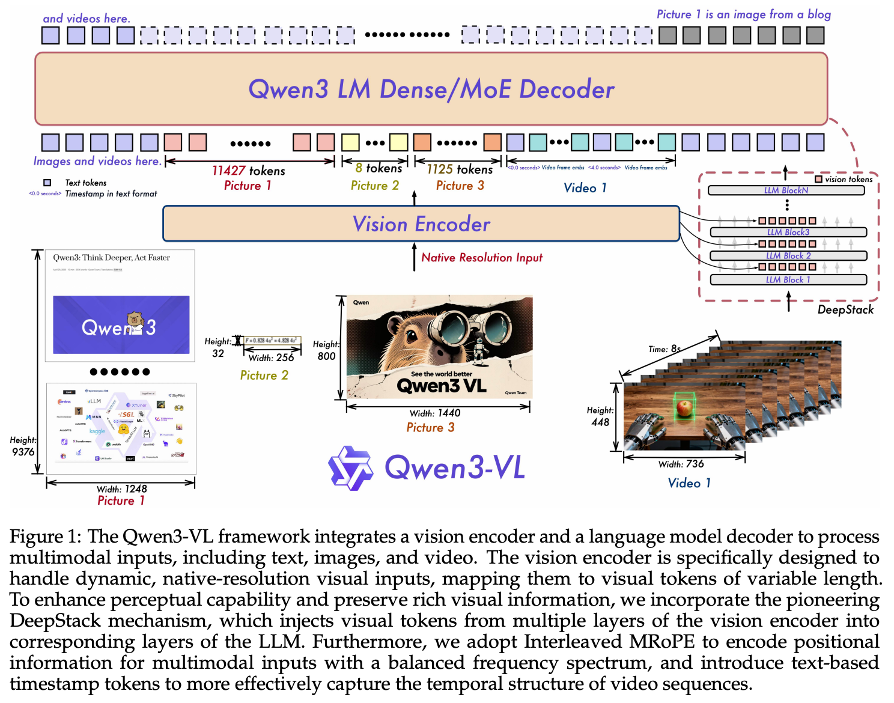

# 5 2025 Qwen3-VL Technical Report

- https://github.com/QwenLM/Qwen3-VL

## Abstract

- We introduce Qwen3-VL, the most capable vision–language model in the Qwen series to date, achieving superior performance across a broad range of multimodal benchmarks.
    - It natively supports **interleaved contexts** of up to 256K tokens, seamlessly integrating text, images, and video. The model family includes both **dense** (2B/4B/8B/32B) and **mixture-of-experts** (30B-A3B/235B-A22B) variants to accommodate diverse latency–quality trade-offs. 

- Qwen3-VL delivers three core pillars: 
    - markedly stronger pure-text understanding, **surpassing comparable text-only backbones in several cases**;
    - robust long-context comprehension with a native 256K-token window for both text and interleaved multimodal inputs, enabling faithful retention, retrieval, and cross referencing across long documents and videos; 
    - advanced multimodal reasoning across single-image, multi-image, and video tasks, demonstrating leading performance on comprehensive evaluations such as MMMU and visual-math benchmarks (e.g., MathVista and MathVision). 
    
- Architecturally, we introduce three key upgrades: 
    - an enhanced **interleaved-MRoPE** for stronger spatial–temporal modeling across images and video; 
    - **DeepStack** integration, which effectively leverages multi-level ViT features to tighten vision–language alignment; 
    - text-based time alignment for video, evolving from **T-RoPE** to explicit textual timestamp alignment for more precise temporal grounding. 
    
- **To balance text-only and multimodal learning objectives, we apply square-root reweighting, which boosts multimodal performance without compromising text capabilities.**

- We extend pretraining to a context length of 256K tokens and bifurcate post-training into non-thinking and thinking variants to address distinct application requirements.

- Furthermore, we allocate additional compute resources to the post-training phase to further enhance model performance. Under comparable token budgets and latency constraints, Qwen3-VL achieves superior performance in both dense and Mixture-of-Experts (MoE) architectures. 

- We envision Qwen3-VL serving as a foundational engine for image-grounded reasoning, agentic decision-making, and multimodal code intelligence in real-world workflows.

## 1 Introduction

- Vision–language models (VLMs) have achieved substantive progress in recent years, evolving from foundational visual perception to advanced multimodal reasoning across images and video. 

- The rapid advancement of VLMs has given rise to a rapidly expanding landscape of downstream applications—such as long-context understanding, STEM reasoning, GUI comprehension and interaction, and agentic workflows. 

- Crucially, these advances must not erode the underlying large language model’s (LLM’s) linguistic proficiency; multimodal models are expected to match or surpass their text-only counterparts on language benchmarks.

- In this report, we present Qwen3-VL and its advances in both general-purpose and advanced applications. **Built on the Qwen3 series** (Yang et al., 2025a), we instantiate four dense models (2B/4B/8B/32B) and two mixture-of-experts (MoE) models (30B-A3B / 235B-A22B), each trained with a context window of up to 256K tokens to enable long-context understanding. 

- By optimizing the training corpus and training strategy, we preserve the underlying LLM’s language proficiency during vision–language (VL) training, thereby substantially improving overall capability. 

- We release both non-thinking and thinking variants; the latter demonstrates significantly stronger multimodal reasoning capabilities, achieving superior performance on complex reasoning tasks.

- We first introduce the architectural improvements, which span three components: 
    - Enhanced positional encoding. In Qwen2.5-VL, we used **MRoPE as a unified positional encoding scheme for text and vision**. We observed that chunking the embedding dimensions into temporal $(t)$, horizontal $(h)$, and vertical $(w)$ groups induces an **imbalanced frequency spectrum** and hampers long-video understanding. We therefore adopt an **interleaved MRoPE** that **distributes $t, h, w$ uniformly across low- and high-frequency bands**, yielding more faithful positional representations. 
    - DeepStack for cross-layer fusion. To strengthen vision–language alignment, we incorporate the pioneering **[DeepStack (Meng et al., 2024)](https://arxiv.org/pdf/2406.04334) mechanism. Visual tokens from different layers of the vision encoder are routed to corresponding LLM layers via lightweight residual connections, enhancing multi-level fusion without introducing extra context length.**
    - Explicit video timestamps. We replace the absolute-time alignment via positional encoding used in Qwen2.5-VL with explicit timestamp tokens to mark frame groups, providing a simpler and more direct temporal representation. 
    - In addition, on the optimization side, we move from a per-sample loss to a square-root-normalized per-token loss, which better balances the contributions of text and multimodal data during training.

- To build a more capable and robust vision–language foundation model, we overhauled our training data in terms of quality, diversity, and structure. 
    - Key upgrades include enhanced caption supervision, expanded omni-recognition and OCR coverage, normalized grounding with 3D/spatial reasoning, and new corpora for code, long documents, and temporally grounded video. 
    - We further infused chain-of-thought reasoning and high-quality, diverse GUI-agent interaction data to bridge perception, reasoning, and action. 
    
- Together, these innovations enable stronger multimodal understanding, precise grounding, and tool-augmented intelligence.

- Our training pipeline consists of two stages: pretraining and post-training. 
    - Pretraining proceeds in four phases: 
        - **a warm-up alignment phase that updates only the merger (vision–language projection)** layers while keeping the rest of the model frozen, 
        - followed by **full-parameter training** with progressively larger context windows at 8K, 32K, and 256K sequence lengths. 
    - Post-training comprises three phases: 
        - supervised fine-tuning on long chain-of-thought data, 
        - knowledge distillation from stronger teacher models, 
        - reinforcement learning.

- The above innovations equip Qwen3-VL with strong capabilities not only as a robust vision–language foundation model but also as a flexible platform for real-world multimodal intelligence—seamlessly integrating perception, reasoning, and action across diverse application domains. 

- In the following sections, we present the model architecture, training framework, and extensive evaluations that demonstrate its consistent and competitive performance on text, vision, and multimodal reasoning benchmarks.

## 2 Model Architecture

- Following Qwen2.5-VL (Bai et al., 2025), Qwen3-VL adopts a three-module architecture comprising 
    - a vision encoder, 
    - an MLP-based vision–language merger, 
    - a large language model (LLM). 
    

- Large Language Model: 
    - Qwen3-VL is instantiated in three dense variants (Qwen3-VL-2B/4B/8B/32B) and two MoE variants (Qwen3-VL-30B-A3B, Qwen3-VL-235B-A22B), all built upon Qwen3 backbones. 
    - The flagship model, Qwen3-VL-235B-A22B, has 235B total parameters with 22B activated per token. It outperforms most VLMs across a broad set of multimodal tasks and **surpasses its text-only counterpart on the majority of language benchmarks**.

- Vision Encoder: 
    - We utilize the **[SigLIP-2 architecture (DeepMind, 2025)](https://arxiv.org/pdf/2502.14786)** as our vision encoder and continue training it with dynamic input resolutions, initialized from official pretrained checkpoints. 
    - To accommodate dynamic resolutions effectively, we employ **2D-RoPE** and interpolate absolute position embeddings based on input size, following the methodology of CoMP (Chen et al., 2025). 
    - Specifically, we default to the SigLIP2-SO-400M variant and use SigLIP2-Large (300M) for small-scale LLMs (2B and 4B).

- MLP-based Vision-Language Merger: 
    - As in Qwen2.5-VL, we use a **two-layer MLP** to compress $2 \times 2$ visual features from the vision encoder into a single visual token, aligned with the LLM’s hidden dimension. 
    - Additionally, we deploy specialized mergers to support the DeepStack mechanism (Meng et al., 2024), the details of which are fully described in Section 2.2.

### 2.1 Interleaved MRoPE

- Qwen2-VL (Wang et al., 2024c) introduced MRoPE to model positional information for multimodal inputs.
    - In its original formulation, the embedding dimensions are partitioned into temporal $(t)$, horizontal $(h)$, and vertical $(w)$ subspaces, each assigned distinct rotary frequencies. 
    - This results in an **imbalanced frequency spectrum**, which subsequent studies have shown to degrade performance on long-video understanding benchmarks. 
    - To address this, we redesign the frequency allocation by interleaving the $t, h, w$ components across the embedding dimensions (Huang et al., 2025). 
    - This ensures that each spatial–temporal axis is uniformly represented across both low- and high-frequency bands. 
    - The resulting balanced spectrum mitigates the original spectral bias and significantly improves long-range positional modeling for video.

### 2.2 DeepStack

- We draw inspiration from DeepStack (Meng et al., 2024) and inject visual tokens into multiple layers of the LLM. 
    - Unlike the original DeepStack approach, which stacks tokens from multi-scale visual inputs, we extend DeepStack to extract visual tokens from intermediate layers of the Vision Transformer (ViT).
    - This design preserves rich visual information, ranging from low- to high-level representations.
    - Specifically, as illustrated in Figure 1, we select features from **three distinct levels** of the vision encoder.
    - Subsequently, **dedicated vision–language merger modules project these multi-level features into visual tokens, which are then added directly to the corresponding hidden states of the first three LLM layers.**

### 2.3 Video Timestamp

- In Qwen2.5-VL, a time-synchronized variant of MRoPE is employed to endow the model with temporal awareness. However, we identify two key limitations of this approach: 
    - By tying temporal position IDs directly to absolute time, the method produces excessively large and sparse temporal position ids for long videos, degrading the model’s ability to understand long temporal contexts. 
    - Effective learning under this scheme requires extensive and uniformly distributed sampling across various frame rates (fps), significantly increasing the cost of training data construction.

- To address these issues, we adopt a **textual token–based time encoding strategy** (Chen et al., 2024b), wherein each video temporal patch is prefixed with a timestamp expressed as a formatted text string—e.g., `<3.0 seconds>`. 
    - Furthermore, during training, we generate timestamps in both seconds and `HMS (hours:minutes:seconds)` formats to ensure the model learns to interpret diverse timecode representations.
    - Although this approach incurs a modest increase in context length, it enables the model to perceive temporal information more effectively and precisely, thereby facilitating time-aware video tasks such as video grounding and dense captioning

## 3 Pre-Training

### 3.1 Training Recipe

- We first enhance the vision encoder by conducting continuous training with dynamic resolutions based on the pre-trained SigLIP-2 model. 
    - The overall Qwen3-VL model adopts a three-module architecture, comprising this vision encoder, an MLP-based vision–language merger, and a Qwen3 large language model (LLM) backbone. 
    - Building on this architecture, our pre-training methodology is systematically structured into four distinct stages, designed to progressively build capabilities from basic alignment to long-context understanding. An overview of these stages is presented below

| Stage | Objective | Training | Token Budget | Sequence Length |
| :--- | :--- | :--- | :--- | :--- |
| S0 | Vision-Language Alignment | Merger | 67B | 8,192 |
| S1 | Multimodal Pre-Training | All | ~1T | 8,192 |
| S2 | Long-Context Pre-Training | All | ~1T | 32,768 |
| S3 | Ultra-Long-Context Adaptation | All | 100B | 262,144 |

- Stage 0: Vision-Language Alignment. 
    - The initial stage (S0) focuses on efficiently bridging the modality gap between the vision encoder and the LLM. 
    - Crucially, only the parameters of the MLP merger are trained during this phase, while both the vision encoder and the LLM backbone remain frozen. 
    - We utilize a curated dataset of approximately 67B tokens, consisting of high-quality image-caption pairs, visual knowledge collections, and optical character recognition (OCR) data. 
    - All training is conducted with a sequence length of 8,192. 
    - This alignment-first approach establishes a solid foundation for cross-modal understanding before proceeding to full-parameter training.

- Stage 1: Multimodal Pre-Training. 
    - Following the initial alignment, Stage 1 (S1) transitions to full parameter Multimodal Pre-Training. 
    - In this phase, we unfreeze all model components—the vision encoder, the merger, and the LLM—for joint end-to-end training. 
    - The model is trained on a massive and diverse dataset of approximately 1 trillion (1T) tokens. To maintain the LLM’s strong language abilities, the data mixture is composed of vision-language (VL) data and text-only data. 
    - The VL portion is rich and varied, adding interleaved image-text documents, visual grounding tasks, visual question answering (VQA), data from STEM domains, and a small amount of video data to introduce temporal understanding. 
    - The sequence length remains at 8,192.

- Stage 2: Long-Context Pre-Training. 
    - Stage 2 (S2) aims to significantly extend the model’s contextual processing abilities. 
    - A key change in this stage is the quadrupling of the sequence length to 32,768, while all model parameters continue to be trainable. 
    - Training is conducted on a dataset of approximately 1T tokens, with an adjusted data mixture to support long-context tasks. 
    - The proportion of text-only data is increased to bolster long-form text comprehension, while the remaining VL data incorporates a significantly larger volume of video and agent-oriented instruction-following data. 
    - This stage is critical for enabling the model to process and reason over longer videos and complex, multi-step tasks.

- Stage 3: Ultra-Long-Context Adaptation. 
    - The final stage (S3) is a specialized phase designed to push the model’s context window to its operational limits. 
    - Here, we dramatically increase the sequence length to 262,144. The model is trained on a more focused 100B token dataset specifically curated for this purpose.
    - The data is also composed of text-only data and VL data, with a strong emphasis on long-video and long-document understanding tasks. 
    - This final adaptation solidifies Qwen3-VL’s proficiency in processing and analyzing extremely long sequential inputs, a key capability for applications like comprehensive document analysis and lengthy video summarization.

### 3.2 Pre-Training Data

- 3.2.1 Image Caption and Interleaved Text-Image Data

- 3.2.2 Knowledge

- 3.2.3 OCR, Document Parsing and Long Document Understanding

- 3.2.4 Grounding and Counting

- 3.2.5 Spatial Understanding and 3D Recognition

- 3.2.6 Code

- 3.2.7 Video

- 3.2.8 Science, Technology, Engineering, and Mathematics (STEM)

- 3.2.9 Agent

## 4 Post-Training

### 4.1 Training Recipe

- Our post-training pipeline is a three-stage process designed to refine the model’s instruction-following capabilities, bolster its reasoning abilities, and align it with human preferences. The specific data and methods for each stage are detailed in the subsequent sections.

- Supervised Fine-Tuning (SFT). 
    - The first stage imparts instruction-following abilities and activates latent reasoning skills. 
    - This is conducted in two phases: an initial phase at a 32k context length, followed by an extension to a 256k context window that focuses on long-document and long-video data. 
    - To cater to different needs, we bifurcate the training data into **standard formats for non-thinking models and Chain-of-Thought (CoT) formats for thinking models**, the latter of which explicitly models the reasoning process.

- Strong-to-Weak Distillation. 
    - The second stage employs **knowledge distillation**, where a powerful teacher model transfers its capabilities to our student models. 
    - Crucially, we perform this distillation using text-only data to fine-tune the LLM backbone. 
    - This method proves highly effective, yielding significant improvements in reasoning abilities across both text-centric and multimodal tasks.

- Reinforcement Learning (RL). 
    - The final stage utilizes RL to further enhance model performance and alignment. 
    - This phase is divided into **Reasoning RL and General RL**. We apply large-scale reinforcement learning across a comprehensive set of text and multimodal domains, including but not limited to math, OCR, grounding, and instruction-following, to improve finer-grained capabilities.

### 4.2 Cold Start Data

- 4.2.1 SFT Data

- 4.2.2 Long-CoT Cold Start Data

### 4.3 Strong-to-Weak Distillation

- We adopt the Strong-to-Weak Distillation pipeline as described in Qwen3 to further improve the performance of lightweight models. This distillation process consists of two main phases:

- Off-policy Distillation: 
    - In the first phase, outputs generated by teacher models are combined to provide response distillation. 
    - This helps lightweight student models acquire fundamental reasoning abilities, establishing a strong foundation for subsequent on-policy training.

- On-policy Distillation: 
    - In the second phase, the student model generates the responses based on the provided prompts. 
    - These on-policy sequences are then used for fine-tuning the student model. 
    - **We align the logits predicted by the student and teacher by minimizing the KL divergence.**

### 4.4 Reinforcement Learning

#### 4.4.1 Reasoning Reinforcement Learning

- We train models across a diverse set of text and multimodal tasks, including mathematics, coding, logical reasoning, visual grounding, and visual puzzles. Each task is designed so that solutions can be verified deterministically via rules or code executors.

- Data Preparation 
    - We curate training data from both open-source and proprietary sources and apply rigorous preprocessing and manual annotation to ensure high-quality RL queries. 
    - For multimodal queries, we use a preliminary checkpoint of our most advanced vision–language model (Qwen3-VL-235BA22B) to sample 16 responses per query; any query for which all responses are incorrect is discarded.
    - We then run preliminary RL experiments per task to identify and remove data sources with limited potential for improvement. 
    - This process yields approximately 30K RL queries covering a variety of text and multimodal tasks. 
    - For training each model, we sample 16 responses for all queries and filter out easy queries whose pass rate exceeds 90%. 
    - We shuffle and combine task-specific datasets to construct mixed-task batches, ensuring a consistent, predefined ratio of samples per task. The ratio is determined through extensive preliminary experiments.

- Reward System 
    - We implement a unified reward framework that delivers precise feedback across all tasks. 
    - The system provides shared infrastructure—data preprocessing, utility functions, and a reward manager to integrate multiple reward types—while the core reward logic is implemented per task. 
    - We use task-specific format prompts to guide model outputs to the required formats and therefore do not rely on explicit format rewards. 
    - To mitigate code-switching, we apply a penalty when the response language differs from the prompt language.

- RL Algorithm 
    - We employ [**SAPO (Qwen Team, 2025)**](https://arxiv.org/pdf/2511.20347), a smooth and adaptive policy-gradient method, for RL training. 
    - SAPO delivers consistent improvements across diverse text and multimodal tasks and across different model sizes and architectures.

#### 4.4.2 General Reinforcement Learning

- The General Reinforcement Learning (RL) stage is designed to enhance the model’s generalization capabilities and operational robustness. 

- To this end, we employ a multi-task RL paradigm where the reward function is formulated based on a comprehensive set of tasks from the SFT phase, including VQA, image captioning, OCR, document parsing, grounding, and clock recognition. 

- The reward mechanism is structured to optimize two principal dimensions of model performance:
    - Instruction Following: This dimension evaluates the model’s adherence to explicit user directives. It assesses the ability to handle complex constraints on content, format, length, and structured outputs (e.g., JSON), ensuring the generated response precisely matches user requirements.
    - Preference Alignment: For open-ended or subjective queries, this dimension aligns the model’s outputs with human preferences by optimizing for helpfulness, factual accuracy, and stylistic appropriateness. This fosters a more natural and engaging user interaction.

- Furthermore, this stage acts as a corrective mechanism to unlearn strong but flawed knowledge priors ingrained during SFT. 
    - We address this by introducing specialized, verifiable tasks designed to trigger these specific errors, such as counter-intuitive object counting and complex clock time recognition. 
    - This targeted intervention is designed to supplant erroneous priors with factual knowledge.

- Another critical objective is to mitigate inferior behaviors like inappropriate language mixing, excessive repetition, and formatting errors. 
    - However, the low prevalence of these issues makes general RL a sample-inefficient correction strategy. To overcome this, we curate a dedicated dataset at this stage. This dataset isolates prompts known to elicit such undesirable behaviors. This focused training enables the application of targeted, high-frequency penalties, effectively suppressing these residual errors.

- Feedback for the RL process is delivered via a hybrid reward system that combines two complementary approaches:
    - Rule-Based Rewards: This approach provides unambiguous, high-precision feedback for tasks with verifiable ground truths, such as format adherence and instruction following. By using well-defined heuristics, this method offers a robust mechanism for assessing correctness and effectively mitigates reward hacking, where a model might exploit ambiguities in a learned reward function.
    - Model-Based Rewards: This method employs Qwen2.5-VL-72B-Instruct or Qwen3 as sophisticated judgers. The judge models evaluate each generated response against a ground-truth reference, scoring its quality across multiple axes. This approach offers superior flexibility for assessing nuanced or openended tasks where strict, rule-based matching is inadequate. It is particularly effective at minimizing false negatives that would otherwise penalize valid responses with unconventional formatting or phrasing.

### 4.5 Thinking with Images

### 4.6 Infrastructure

## 5 Evaluation

## 6 Conclusion

- In this work, we present Qwen3-VL, a state-of-the-art series of vision–language foundation models that advances the frontier of multimodal understanding and generation. By integrating high-quality multimodal data iteration and architectural innovations—such as enhanced interleaved-MRoPE, DeepStack vision-language alignment, and text-based temporal grounding—Qwen3-VL achieves unprecedented performance across a broad spectrum of multimodal benchmarks while maintaining strong pure-text capabilities. 

- Its native support for 256K-token interleaved sequences enables robust reasoning over long, complex documents, image sequences, and videos, making it uniquely suited for real-world applications demanding high-fidelity cross-modal comprehension. The availability of both dense and Mixture-of-Experts variants ensures flexible deployment across diverse latency and quality requirements, and our post-training strategy—including non-thinking and thinking modes.

- Looking forward, we envision Qwen3-VL as a foundational engine for embodied AI agents capable of seamlessly bridging the digital and physical worlds. Such agents will not only perceive and reason over rich multimodal inputs but also execute decisive, context-aware actions in dynamic environments—interacting with users, manipulating digital interfaces, and guiding robotic systems through grounded, multimodal decision-making. 

- Future work will focus on extending Qwen3-VL’s capabilities toward interactive perception, tool-augmented reasoning, and real-time multimodal control, with the ultimate goal of enabling AI systems that learn, adapt, and collaborate alongside humans in both virtual and physical domains. 

- Additionally, we are actively exploring unified understanding-generation architectures, leveraging visual generation capabilities to elevate overall intelligence further. 

- By openly releasing the entire model family under the Apache 2.0 license, we aim to catalyze community-driven innovation toward the vision of truly integrated, multimodal AI agents.
