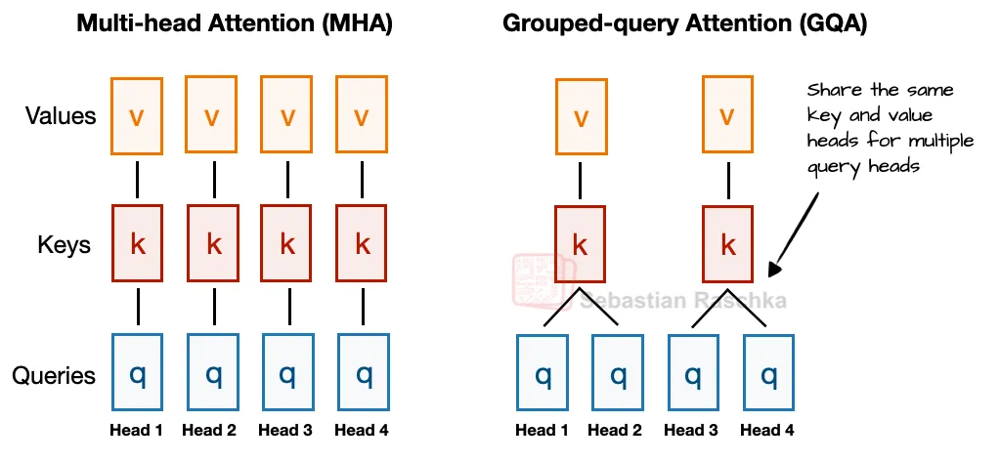
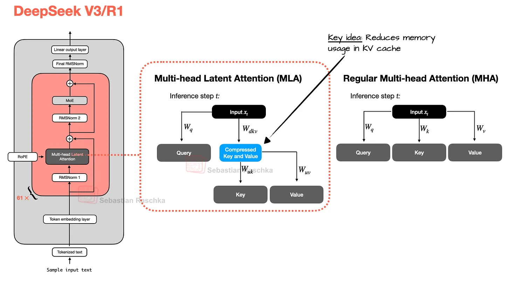
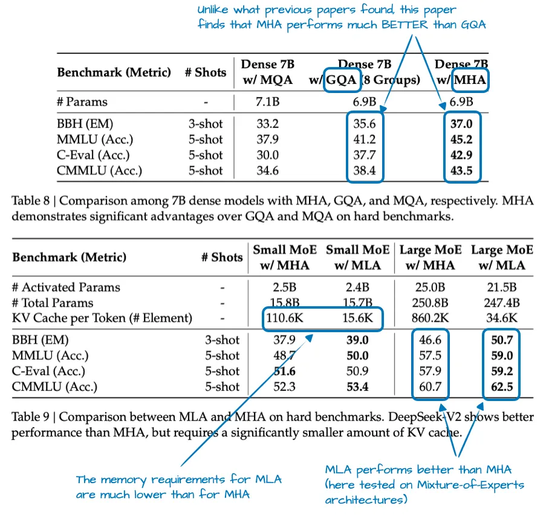
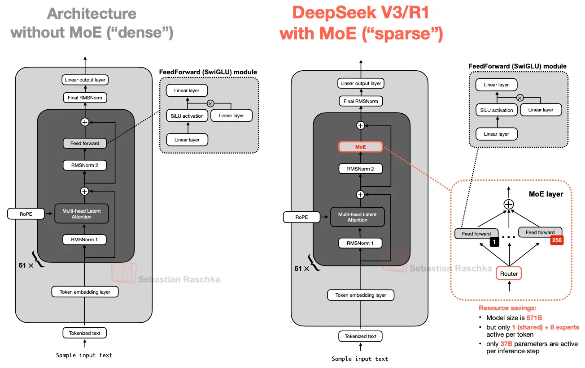
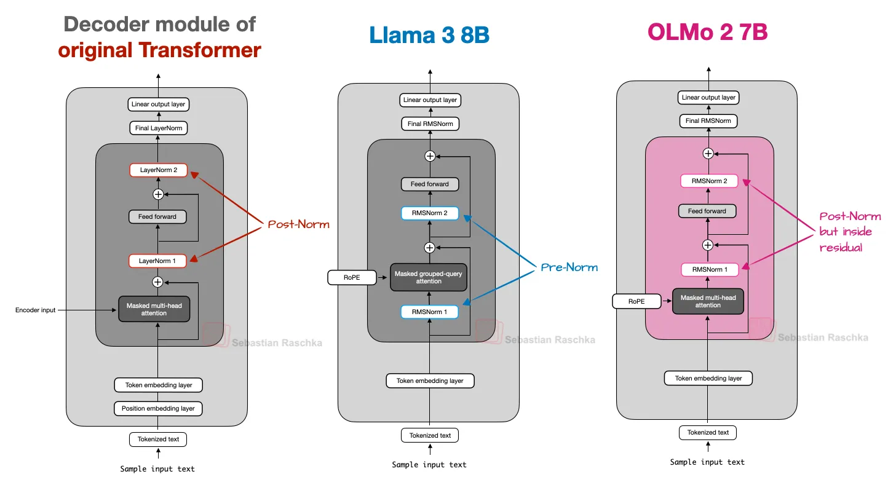

# 6 2025 The Big LLM Architecture Comparison

- [From DeepSeek V3 to GLM-5: A Look At Modern LLM Architecture Design](https://magazine.sebastianraschka.com/p/the-big-llm-architecture-comparison)

---

- It has been seven years since the original GPT architecture was developed. 
    - At first glance, looking back at **GPT-2 (2019)** and forward to DeepSeek V3 and Llama 4 (2024-2025), one might be surprised at how structurally similar these models still are.
        - Sure, positional embeddings have evolved from absolute to rotational (**RoPE**), 
        - Multi-Head Attention has largely given way to **Grouped-Query Attention**, 
        - and the more efficient **SwiGLU** has replaced activation functions like GELU. 
    - But beneath these minor refinements, have we truly seen groundbreaking changes, or are we simply polishing the same architectural foundations?

- Comparing LLMs to determine the key ingredients that contribute to their good (or not-so-good) performance is notoriously challenging: datasets, training techniques, and hyperparameters vary widely and are often not well documented.
    - However, I think that there is still a lot of value in examining the structural changes of the architectures themselves to see what LLM developers are up to in 2025. (A subset of them are shown in Figure 1 below.)

- So, in this article, rather than writing about benchmark performance or training algorithms, I will focus on the architectural developments that define today's flagship open models.

- As you may remember, I wrote about [multimodal LLMs](https://magazine.sebastianraschka.com/p/understanding-multimodal-llms) not too long ago; in this article, I will focus on the text capabilities of recent models and **leave the discussion of multimodal capabilities for another time.**

## 1. DeepSeek V3/R1

- As you have probably heard more than once by now, DeepSeek R1 made a big impact when it was released in January 2025. DeepSeek R1 is a reasoning model built on top of the DeepSeek V3 architecture, which was introduced in December 2024.

- In this section, I’ll focus on two key architectural techniques introduced in DeepSeek V3 that improved its computational efficiency and distinguish it from many other LLMs:
    - **Multi-Head Latent Attention (MLA)**
    - **Mixture-of-Experts (MoE)**

### 1.1 Multi-Head Latent Attention (MLA)

- Before discussing Multi-Head Latent Attention (MLA), let's briefly go over some background to motivate why it's used. 
    - For that, let's start with **Grouped-Query Attention (GQA)**, which has become the new standard replacement for a more compute- and parameter-efficient alternative to **Multi-Head Attention (MHA)** in recent years.

- So, here's a brief GQA summary. Unlike MHA, where each head also has its own set of keys and values, to reduce memory usage, GQA groups multiple heads to share the same key and value projections.
    - For example, as further illustrated in Figure 2 below, if there are 2 key-value groups and 4 attention heads, then heads 1 and 2 might share one set of keys and values, while heads 3 and 4 share another. This reduces the total number of key and value computations, which leads to lower memory usage and improved efficiency (without noticeably affecting the modeling performance, according to ablation studies).

- So, the core idea behind GQA is to reduce the number of key and value heads by sharing them across multiple query heads. 
    - This (1) lowers the model's parameter count 
    - and (2) reduces the memory bandwidth usage for key and value tensors during inference since fewer keys and values need to be stored and retrieved from the KV cache.

- (If you are curious how GQA looks in code, see my [GPT-2 to Llama 3 conversion guide](https://github.com/rasbt/LLMs-from-scratch/blob/main/ch05/07_gpt_to_llama/converting-llama2-to-llama3.ipynb) for a version without KV cache and my KV-cache variant [here](https://github.com/rasbt/LLMs-from-scratch/blob/main/pkg/llms_from_scratch/llama3.py))

- While GQA is mainly a computational-efficiency workaround for MHA, ablation studies (such as those in the original GQA paper and the Llama 2 paper) show it performs comparably to standard MHA in terms of LLM modeling performance.

- Now, **Multi-Head Latent Attention (MLA) offers a different memory-saving strategy** that also pairs particularly well with KV caching. 
    - **Instead of sharing key and value heads like GQA, MLA compresses the key and value tensors into a lower-dimensional space before storing them in the KV cache.**

- At inference time, these compressed tensors are projected back to their original size before being used, as shown in the Figure 3 below. This adds an extra matrix multiplication but reduces memory usage.

- **As a side note, the queries are also compressed, but only during training, not inference.**

- By the way, MLA is not new in DeepSeek V3, as its DeepSeek-V2 predecessor also used (and even introduced) it. **Also, the V2 paper contains a few interesting ablation studies that may explain why the DeepSeek team chose MLA over GQA (see Figure 4 below).**

- As shown in Figure 4 above, 
    - GQA appears to perform worse than MHA, 
    - whereas MLA offers better modeling performance than MHA, 
    - which is likely why the DeepSeek team chose MLA over GQA. (It would have been interesting to see the "KV Cache per Token" savings comparison between MLA and GQA as well!)

- To summarize this section before we move on to the next architecture component, 
    - MLA is a clever trick to reduce KV cache memory use while even slightly outperforming MHA in terms of modeling performance.

### 1.2 Mixture-of-Experts (MoE)

- The other major architectural component in DeepSeek worth highlighting is its use of Mixture-of-Experts (MoE) layers. 
    - While DeepSeek did not invent MoE, it has seen a resurgence this year, and many of the architectures we will cover later also adopt it.

- You are likely already familiar with MoE, but a quick recap may be helpful.
    - The core idea in MoE is to replace each FeedForward module in a transformer block with multiple expert layers, where each of these expert layers is also a FeedForward module. 
    - **This means that we swap a single FeedForward block for multiple FeedForward blocks**, as illustrated in the Figure 5 below.

- The FeedForward block inside a transformer block (shown as the dark gray block in the figure above) **typically contains a large number of the model's total parameters.** (Note that the transformer block, and thereby the FeedForward block, is repeated many times in an LLM; in the case of **DeepSeek V3, 61 times.**)

- So, replacing a single FeedForward block with multiple FeedForward blocks (as done in a MoE setup) substantially increases the model's total parameter count. 
    - However, the key trick is that we don't use ("activate") all experts for every token. Instead, a router selects only a small subset of experts per token. (In the interest of time, or rather article space, I'll cover the router in more detail another time.)

- Because only a few experts are active at a time, MoE modules are often referred to as sparse, in contrast to dense modules that always use the full parameter set. 
    - However, the large total number of parameters via an MoE increases the capacity of the LLM, which means it can take up more knowledge during training. The sparsity keeps inference efficient, though, as we don't use all the parameters at the same time.

- For example, DeepSeek V3 has **256 experts per MoE** module and a total of 671 billion parameters. Yet during inference, only **9 experts are active at a time (1 shared expert plus 8 selected by the router)**. This means just 37 billion parameters are used per inference step as opposed to all 671 billion.

- **One notable feature of DeepSeek V3's MoE design is the use of a shared expert.** This is an expert that is always active for every token. This idea is not new and was already introduced in the DeepSeek 2024 MoE and 2022 DeepSpeedMoE papers.
    - The benefit of having a shared expert was first noted in the DeepSpeedMoE paper, where they found that it boosts overall modeling performance compared to no shared experts. This is likely because common or repeated patterns don't have to be learned by multiple individual experts, which leaves them with more room for learning more specialized patterns.

### 1.3 DeepSeek Summary

- To summarize, DeepSeek V3 is a massive 671-billion-parameter model that, at launch, **outperformed other open-weight models, including the 405B Llama 3**. 
    - Despite being larger, it is much more efficient at inference time thanks to its Mixture-of-Experts (MoE) architecture, which activates only a small subset of (just 37B) parameters per token.

- Another key distinguishing feature is DeepSeek V3's use of Multi-Head Latent Attention (MLA) instead of Grouped-Query Attention (GQA). 
    - Both MLA and GQA are inference-efficient alternatives to standard Multi-Head Attention (MHA), particularly when using KV caching. While MLA is more complex to implement, a study in the DeepSeek-V2 paper has shown it delivers better modeling performance than GQA.

---

## 2. OLMo 2

- The OLMo series of models by the non-profit **Allen Institute for AI** is noteworthy due to its transparency in terms of training data and code, as well as the relatively detailed technical reports.

- While you probably won’t find OLMo models at the top of any benchmark or leaderboard, they are pretty clean and, more importantly, a great blueprint for developing LLMs, thanks to their transparency.

- And while OLMo models are popular because of their transparency, they are not that bad either. In fact, at the time of release in January (before Llama 4, Gemma 3, and Qwen 3), OLMo 2 models were sitting at the Pareto frontier of compute to performance, as shown in Figure 7 below.

- As mentioned earlier in this article, I aim to focus only on the LLM architecture details (not training or data) to keep it at a manageable length. So, what were the interesting architectural design choices in OLMo2? It mainly comes down to normalizations: the placement of **RMSNorm** layers as well as the addition of a **QK-norm**, which I will discuss below.

- **Another thing worth mentioning is that OLMo 2 still uses traditional Multi-Head Attention (MHA) instead of MLA or GQA.**

### 2.1 Normalization Layer Placement

- Overall, OLMo 2 largely follows the architecture of the **original GPT model**, similar to other contemporary LLMs. However, there are some noteworthy deviations. Let's start with the normalization layers.

- **Similar to Llama, Gemma, DeepSeek-V3, and most other LLMs, OLMo 2 switched from LayerNorm to RMSNorm.**

- **But since RMSNorm is old hat (it's basically a simplified version of LayerNorm with fewer trainable parameters)**, I will skip the discussion of RMSNorm vs LayerNorm. (Curious readers can find an RMSNorm code implementation in my GPT-2 to Llama conversion guide.)

- **However, it's worth discussing the placement of the RMSNorm layer.** 
    - The original transformer (from the "Attention is all you need" paper) placed the two normalization layers in the transformer block after the attention module and the FeedForward module, respectively. This is also known as Post-LN or **Post-Norm**.

- GPT and most other LLMs that came after placed the normalization layers before the attention and FeedForward modules, which is known as Pre-LN or **Pre-Norm**. A comparison between Post- and Pre-Norm is shown in the figure below.

- In 2020, Xiong et al. showed that **Pre-LN results in more well-behaved gradients at initialization. Furthermore, the researchers mentioned that Pre-LN even works well without careful learning rate warm-up, which is otherwise a crucial tool for Post-LN.**

- Now, the reason I am mentioning that is that OLMo 2 adopted a form of Post-LN (but with RMSNorm instead of LayerNorm, so I am calling it Post-Norm).

- In OLMo 2, instead of placing the normalization layers before the attention and FeedForward layers, they place them after, as shown in the figure above. However, notice that in contrast to the original transformer architecture, the normalization layers are still inside the residual layers (skip connections).

- So, why did they move the position of the normalization layers? The reason is that it helped with training stability, as shown in the figure below.

- **Unfortunately this figure shows the results of the reordering together with QK-Norm, which is a separate concept. So, it’s hard to tell how much the normalization layer reordering contributed by itself.**

### 2.2 QK-Norm

- Since the previous section already mentioned the QK-norm, and **other LLMs we discuss later, such as Gemma 2 and Gemma 3, also use QK-norm**, let's briefly discuss what this is.

- QK-Norm is essentially yet another RMSNorm layer. 
    - **It's placed inside the Multi-Head Attention (MHA) module and applied to the queries (q) and keys (k) before applying RoPE.** 

- As mentioned earlier, **together with Post-Norm, QK-Norm stabilizes the training**. Note that QK-Norm was not invented by OLMo 2 but goes back to the **2023 Scaling Vision Transformers paper**.

### 2.3 OLMo 2 Summary

- In short, the noteworthy OLMo 2 architecture design decisions are primarily 
    - the RMSNorm placements: RMSNorm after instead of before the attention and FeedForward modules (a flavor of Post-Norm), 
    - as well as the addition of RMSNorm for the queries and keys inside the attention mechanism (QK-Norm), 
    - which both, together, help stabilize the training loss.

---

