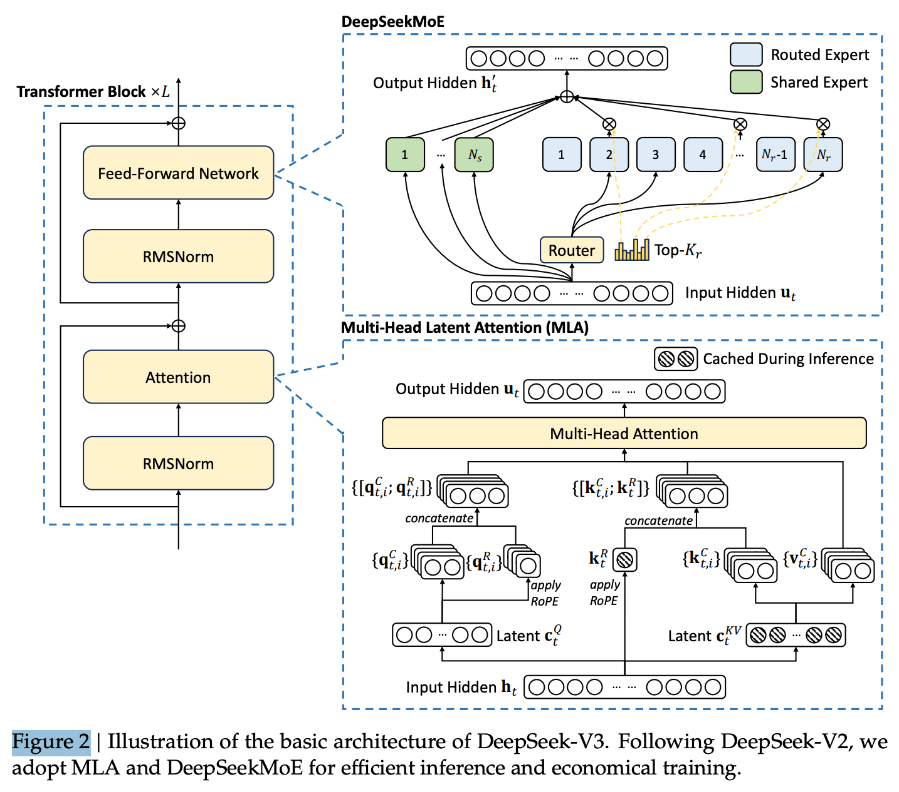
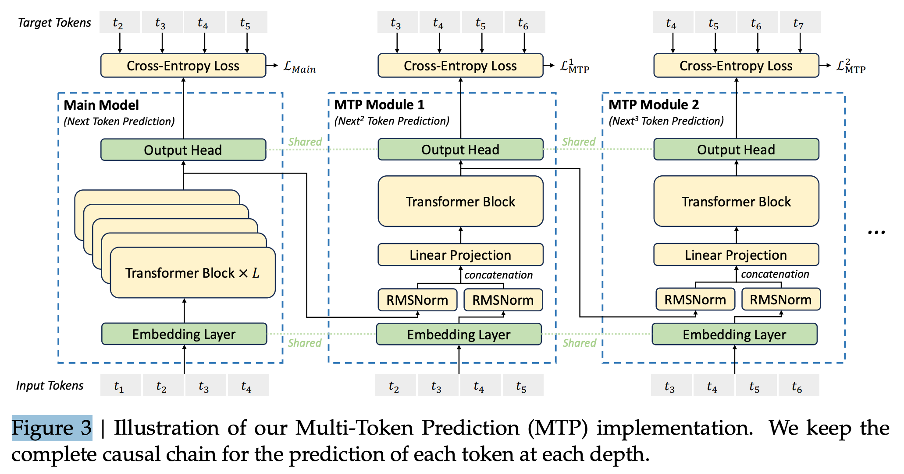

# 7 2024 DeepSeek-V3

- [DeepSeek-V3 Technical Report](https://arxiv.org/pdf/2412.19437)

- The model checkpoints are available at https://github.com/deepseek-ai/DeepSeek-V3

## Abstract

- We present DeepSeek-V3, a strong **Mixture-of-Experts (MoE)** language model with 671B total parameters with 37B activated for each token. 
    - To achieve efficient inference and cost-effective training, DeepSeek-V3 adopts **Multi-head Latent Attention (MLA) and DeepSeekMoE** architectures, which were thoroughly validated in DeepSeek-V2. 
    - Furthermore, DeepSeek-V3 pioneers an auxiliary-loss-free strategy for load balancing and sets a **multi-token prediction training objective** for stronger performance. 
    - We **pre-train** DeepSeek-V3 on 14.8 trillion diverse and high-quality tokens, followed by **Supervised Fine-Tuning** and **Reinforcement Learning** stages to fully harness its capabilities. 
    - Comprehensive evaluations reveal that DeepSeek-V3 outperforms other open-source models and achieves performance comparable to leading closed-source models. 
    - Despite its excellent performance, DeepSeek-V3 requires only 2.788M H800 GPU hours for its full training. 
    - In addition, its training process is remarkably stable. Throughout the entire training process, we did not experience any irrecoverable loss spikes or perform any rollbacks.

## 1. Introduction

- In recent years, Large Language Models (LLMs) have been undergoing rapid iteration and evolution (Anthropic, 2024; Google, 2024; OpenAI, 2024a), progressively diminishing the gap towards Artificial General Intelligence (AGI). 
    - Beyond closed-source models, open-source models, including DeepSeek series (DeepSeek-AI, 2024a,b,c; Guo et al., 2024), LLaMA series (AI@Meta, 2024a,b; Touvron et al., 2023a,b), Qwen series (Qwen, 2023, 2024a,b), and Mistral series (Jiang et al., 2023; Mistral, 2024), are also making significant strides, endeavoring to close the gap with their closed-source counterparts. 
    - To further push the boundaries of open-source model capabilities, we scale up our models and introduce DeepSeek-V3, a large Mixture-of-Experts (MoE) model with 671B parameters, of which 37B are activated for each token.
    - With a forward-looking perspective, we consistently strive for strong model performance and economical costs. 
    - Therefore, in terms of architecture, DeepSeek-V3 still adopts Multi-head Latent Attention (MLA) (DeepSeek-AI, 2024c) for efficient inference and DeepSeekMoE (Dai et al., 2024) for cost-effective training. 
    - These two architectures have been validated in DeepSeekV2 (DeepSeek-AI, 2024c), demonstrating their capability to maintain robust model performance while achieving efficient training and inference. 
    - Beyond the basic architecture, we implement two additional strategies to further enhance the model capabilities. 
        - Firstly, DeepSeek-V3 pioneers an auxiliary-loss-free strategy (Wang et al., 2024a) for load balancing, with the aim of minimizing the adverse impact on model performance that arises from the effort to encourage load balancing. 
        - Secondly, DeepSeek-V3 employs a multi-token prediction training objective, which we have observed to enhance the overall performance on evaluation benchmarks.
    - In order to achieve efficient training, we support the FP8 mixed precision training and implement comprehensive optimizations for the training framework. 
    - Low-precision training has emerged as a promising solution for efficient training (Dettmers et al., 2022; Kalamkar et al., 2019; Narang et al., 2017; Peng et al., 2023b), its evolution being closely tied to advancements in hardware capabilities (Luo et al., 2024; Micikevicius et al., 2022; Rouhani et al., 2023a). 
    - In this work, we introduce an FP8 mixed precision training framework and, for the first time, validate its effectiveness on an extremely large-scale model. 
    - Through the support for FP8 computation and storage, we achieve both accelerated training and reduced GPU memory usage. 
    - As for the training framework, we design the `DualPipe algorithm` for efficient pipeline parallelism, which has fewer pipeline bubbles and hides most of the communication during training through computation-communication overlap. 
    - This overlap ensures that, as the model further scales up, as long as we maintain a constant computation-to-communication ratio, we can still employ fine-grained experts across nodes while achieving a near-zero all-to-all communication overhead.
    - In addition, we also develop efficient cross-node all-to-all communication kernels to fully utilize InfiniBand (IB) and NVLink bandwidths. 
    - Furthermore, we meticulously optimize the memory footprint, making it possible to train DeepSeek-V3 without using costly tensor parallelism.
    - Combining these efforts, we achieve high training efficiency. 

- During pre-training, we train DeepSeek-V3 on 14.8T high-quality and diverse tokens. The pre-training process is remarkably stable. Throughout the entire training process, we did not encounter any irrecoverable loss spikes or have to roll back. 
    - Next, we conduct a two-stage context length extension for DeepSeek-V3. In the first stage, the maximum context length is extended to 32K, and in the second stage, it is further extended to 128K. 
    - Following this, we conduct post-training, including Supervised Fine-Tuning (SFT) and Reinforcement Learning (RL) on the base model of DeepSeek-V3, to align it with human preferences and further unlock its potential. 
    - During the post-training stage, we distill the reasoning capability from the DeepSeekR1 series of models, and meanwhile carefully maintain the balance between model accuracy and generation length.

- We evaluate DeepSeek-V3 on a comprehensive array of benchmarks. Despite its economical training costs, comprehensive evaluations reveal that DeepSeek-V3-Base has emerged as the strongest open-source base model currently available, especially in code and math. 
    - Its chat version also outperforms other open-source models and achieves performance comparable to leading closed-source models, including GPT-4o and Claude-3.5-Sonnet, on a series of standard and open-ended benchmarks.

- Lastly, we emphasize again the economical training costs of DeepSeek-V3, summarized in Table 1, achieved through our optimized co-design of algorithms, frameworks, and hardware.
    - During the pre-training stage, training DeepSeek-V3 on each trillion tokens requires only 180K H800 GPU hours, i.e., 3.7 days on our cluster with 2048 H800 GPUs. 
    - Consequently, our pretraining stage is completed in less than two months and costs 2664K GPU hours. 
    - Combined with 119K GPU hours for the context length extension and 5K GPU hours for post-training, DeepSeek-V3 costs only 2.788M GPU hours for its full training. 
    - Assuming the rental price of the H800 GPU is USD 2 per GPU hour, our total training costs amount to only USD 5.576M. 
    - Note that the aforementioned costs include only the official training of DeepSeek-V3, excluding the costs associated with prior research and ablation experiments on architectures, algorithms, or data.

---

- **Our main contribution includes:**

- Architecture: Innovative Load Balancing Strategy and Training Objective
    - On top of the efficient architecture of DeepSeek-V2, we pioneer an auxiliary-loss-free strategy for load balancing, which minimizes the performance degradation that arises from encouraging load balancing.
    - We investigate a Multi-Token Prediction (MTP) objective and prove it beneficial to model performance. It can also be used for speculative decoding for inference acceleration.

- Pre-Training: Towards Ultimate Training Efficiency
    - We design an FP8 mixed precision training framework and, for the first time, validate the feasibility and effectiveness of FP8 training on an extremely large-scale model.
    - Through the co-design of algorithms, frameworks, and hardware, we overcome the communication bottleneck in cross-node MoE training, achieving near-full computation communication overlap. This significantly enhances our training efficiency and reduces the training costs, enabling us to further scale up the model size without additional overhead.
    - At an economical cost of only **2.7M H800 GPU hours**, we complete the pre-training of DeepSeek-V3 on 14.8T tokens, producing the currently strongest open-source base model. **The subsequent training stages after pre-training require only 0.1M GPU hours.**

- Post-Training: **Knowledge Distillation from DeepSeek-R1**
    - We introduce an innovative methodology to distill reasoning capabilities from the longChain-of-Thought (CoT) model, specifically from one of the DeepSeek R1 series models, into standard LLMs, particularly DeepSeek-V3. Our pipeline elegantly incorporates the verification and reflection patterns of R1 into DeepSeek-V3 and notably improves its reasoning performance. Meanwhile, we also maintain control over the output style and length of DeepSeek-V3.

- Summary of Core Evaluation Results
    - Knowledge: 
        - On educational benchmarks such as MMLU, MMLU-Pro, and GPQA, DeepSeek-V3 outperforms all other open-source models, achieving 88.5 on MMLU, 75.9 on MMLU-Pro, and 59.1 on GPQA. Its performance is comparable to leading closed-source models like GPT-4o and Claude-Sonnet-3.5, narrowing the gap between open-source and closed-source models in this domain. 
        - For factuality benchmarks, DeepSeek-V3 demonstrates superior performance among open-source models on both SimpleQA and Chinese SimpleQA. While it trails behind GPT-4o and Claude-Sonnet-3.5 in English factual knowledge (SimpleQA), it surpasses these models in Chinese factual knowledge (Chinese SimpleQA), highlighting its strength in Chinese factual knowledge.
    - Code, Math, and Reasoning: 
        - DeepSeek-V3 achieves state-of-the-art performance on math-related benchmarks among all non-long-CoT open-source and closed-source models. Notably, it even outperforms o1-preview on specific benchmarks, such as MATH-500, demonstrating its robust mathematical reasoning capabilities. 
        - On coding-related tasks, DeepSeek-V3 emerges as the top-performing model for coding competition benchmarks, such as LiveCodeBench, solidifying its position as the leading model in this domain. For engineering-related tasks, while DeepSeek-V3 performs slightly below Claude-Sonnet-3.5, it still outpaces all other models by a significant margin, demonstrating its competitiveness across diverse technical benchmarks.

- In the remainder of this paper, 
    - we first present a detailed exposition of our DeepSeek-V3 model architecture (Section 2). 
    - Subsequently, we introduce our infrastructures, encompassing our compute clusters, the training framework, the support for FP8 training, the inference deployment strategy, and our suggestions on future hardware design. 
    - Next, we describe our pre-training process, including the construction of training data, hyper-parameter settings, long context extension techniques, the associated evaluations, as well as some discussions (Section 4).
    - Thereafter, we discuss our efforts on post-training, which include Supervised Fine-Tuning (SFT), Reinforcement Learning (RL), the corresponding evaluations, and discussions (Section 5). 
    - Lastly, we conclude this work, discuss existing limitations of DeepSeek-V3, and propose potential directions for future research (Section 6).

## 2. Architecture

- We first introduce the basic architecture of DeepSeek-V3, featured by Multi-head Latent Attention (MLA) (DeepSeek-AI, 2024c) for efficient inference and DeepSeekMoE (Dai et al., 2024) for economical training. 

- Then, we present a Multi-Token Prediction (MTP) training objective, which we have observed to enhance the overall performance on evaluation benchmarks. For other minor details not explicitly mentioned, DeepSeek-V3 adheres to the settings of DeepSeekV2 (DeepSeek-AI, 2024c).

### 2.1. Basic Architecture

- The basic architecture of DeepSeek-V3 is still within the Transformer (Vaswani et al., 2017) framework. 
    - For efficient inference and economical training, DeepSeek-V3 also adopts MLA and DeepSeekMoE, which have been thoroughly validated by DeepSeek-V2. 
    - Compared with DeepSeek-V2, an exception is that we additionally introduce an auxiliary-loss-free load balancing strategy (Wang et al., 2024a) for DeepSeekMoE to mitigate the performance degradation induced by the effort to ensure load balance. 
    - Figure 2 illustrates the basic architecture of DeepSeek-V3, and we will briefly review the details of MLA and DeepSeekMoE in this section.

#### 2.1.1. Multi-Head Latent Attention

- For attention, DeepSeek-V3 adopts the MLA architecture. **The core of MLA is the low-rank joint compression for attention keys and values to reduce Key-Value (KV) cache during inference:**

- $d$: embedding dimension 
- $n_h$: number of attention heads 
- $d_h$ dimension per head 
- $h_t \in R^d$: attention input for the $t$-th token at a given attention layer

- compressed latent vector: $c_t^{KV} \in R^{d_c} \quad c_t^Q \in R^{d_c'}$ 
- down-projection matrix: $W^{DKV} \in R^{d_c \times d} \quad W^{DQ} \in R^{d_c'\times d}$
- up-projection matrix: $W^{UK}, W^{UV} \in R^{d_h n_h \times d_c} \quad W^{UQ} \in R^{d_h n_h \times d_c'}$ 
- matrix for RoPE: 
    - $W^{KR} \in R^{d_h^R \times d}$: one positional key is shared by all heads to minimize KV cache
    - $W^{QR} \in R^{d_h^R n_h \times d_c'}$: each head gets its own positional query to allow diverse attention patterns
- output projection matrix: $W^O \in R^{d\times d_h n_h}$
- $[\cdot ; \cdot]$ denotes concatenation

$$
\textbf{C: Content Component} \quad \textbf{R: RoPE Component} \\[5pt]
W^{DKV} h_t = \boxed{c_t^{KV}} \to \begin{cases}
W^{UK} c_t^{KV} = k_t^C = [k_{t,1}^C ;...; k_{t, n_h}^C] \\
W^{UV} c_t^{KV} = v_t^C
\end{cases} \\[5pt]
\text{RoPE}(W^{KR} h_t) = \boxed{k_t^R} \to k_{t, i} = [k_{t, i}^C; k_t^R] \\[5pt]
W^{DQ} h_t = c_t^Q \to \begin{cases}
W^{UQ} c_t^Q = q_t^C \\
\text{RoPE}(W^{QR} c_t^Q) = q_t^R
\end{cases} \to q_{t, i} = [ q_{t, i}^C ; q_{t, i}^R ] \\[10pt]
\text{Attention:}\quad o_{t,i} = \sum_{j=1}^t \text{Softmax}_j \left({ q_{t,i}^T \; k_{j,i} \over \sqrt{d_h + d_h^R} }\right) v_{j,i}^C \\[5pt]
u_t = W^O o_t
$$

- Note that for MLA, only the boxed vectors need to be cached during generation, which results in significantly reduced KV cache while maintaining performance comparable to standard Multi-Head Attention (MHA) (Vaswani et al., 2017).

#### 2.1.2. DeepSeekMoE with Auxiliary-Loss-Free Load Balancing

- **Basic Architecture of DeepSeekMoE** 
    - For Feed-Forward Networks (FFNs), DeepSeek-V3 employs the DeepSeekMoE architecture (Dai et al., 2024). Compared with traditional MoE architectures like GShard (Lepikhin et al., 2021), DeepSeekMoE uses finer-grained experts and isolates some experts as shared ones. 

- Let $u_t$ denote the FFN input of the $t$-th token, we compute
the FFN output $h_t'$ as follows:

$$
h_t' = u_t + \sum_{i=1}^{N_s} \text{FFN}_i^s (u_t) + \sum_{i=1}^{N_r} { g_{i,t} \over \sum_{j=1}^{N_r} g_{j,t} }  \text{FFN}_i^r (u_t) \\[5pt]
g_{i,t} = \begin{cases}
s_{i,t} & s_{i,t} + b_i \in \text{Topk}(\{s_{i,t} + b_i\}, K_r) \\
0 & \text{otherwise}
\end{cases} \\[5pt]
s_{i,t} = \text{Sigmoid}(u_t^T e_i)
$$

- $s$: shared expert, $r$: routed expert 
- $s_{i,t}$: affinity score between $t$-th token and $i$-th routed expert 
- $e_i$: centroid vector of the $i$-th routed expert

- Slightly different from DeepSeek-V2, **DeepSeek-V3 uses the sigmoid function to compute the affinity scores**, and applies a **normalization** among all selected affinity scores to produce the gating values.

- **Auxiliary-Loss-Free Load Balancing** 
    - For MoE models, an unbalanced expert load will lead to routing collapse (Shazeer et al., 2017) and diminish computational efficiency in scenarios with expert parallelism.
    - Conventional solutions usually rely on the auxiliary loss (Fedus et al., 2021; Lepikhin et al., 2021) to avoid unbalanced load. 
    - However, too large an auxiliary loss will impair the model performance (Wang et al., 2024a). 
    - To achieve a better trade-off between load balance and model performance, we pioneer an auxiliary-loss-free load balancing strategy (Wang et al., 2024a) to ensure load balance. To be specific, **we introduce a bias term $b_i$ for each expert** and add it to the corresponding affinity scores $s_{i,t}$ to determine the top-K routing
    - Note that the bias term is only used for routing. The gating value, which will be multiplied with the FFN output, is still derived from the original affinity score $s_{i,t}$
    - During training, we keep monitoring the expert load on the whole batch of each training step. 
    - At the end of each step, we will decrease the bias term by $\gamma$ if its corresponding expert is overloaded, and increase it by $\gamma$ if its corresponding expert is underloaded, where $\gamma$ is a hyper-parameter called bias update speed. 
    - Through the dynamic adjustment, DeepSeek-V3 keeps balanced expert load during training, and achieves better performance than models that encourage load balance through pure auxiliary losses.

- **Complementary Sequence-Wise Auxiliary Loss** 
    - Although DeepSeek-V3 mainly relies on the auxiliary-loss-free strategy for load balance, to prevent extreme imbalance within any single sequence, we also employ a complementary sequence-wise balance loss:
    - where the balance factor $\alpha$ is a hyper-parameter, which will be assigned an extremely small value for DeepSeek-V3; 
    - $\text{Ind}()$ denotes the indicator function; 
    - and $T$ denotes the number of tokens in a sequence. 
    - The sequence-wise balance loss encourages the expert load on each sequence to be balanced.

$$
L_\text{Bal} = \alpha \sum_{i=1}^{N_r} f_i P_i \\[5pt]
f_i = {N_r \over K_r T} \sum_{t=1}^T \text{Ind}( s_{i,t} \in \text{Topk} ) \\[5pt]
P_i = {1\over T} \sum_{t=1}^T {s_{i,t} \over \sum_{j=1}^{N_r} s_{j,t} }
$$

- **Node-Limited Routing.** 
    - Like the device-limited routing used by DeepSeek-V2, DeepSeek-V3 also uses a restricted routing mechanism to limit communication costs during training. 
    - In short, we ensure that each token will be sent to at most $M$ nodes, which are selected according to the sum of the highest ${K_r \over M}$ affinity scores of the experts distributed on each node. 
    - Under this constraint, our MoE training framework can nearly achieve full computation-communication overlap.

- **No Token-Dropping.** 
    - Due to the effective load balancing strategy, DeepSeek-V3 keeps a good load balance during its full training. 
    - Therefore, DeepSeek-V3 does not drop any tokens during training. 
    - In addition, we also implement specific deployment strategies to ensure inference load balance, so DeepSeek-V3 also does not drop tokens during inference.

### 2.2. Multi-Token Prediction

- Inspired by Gloeckle et al. (2024), we investigate and set a Multi-Token Prediction (MTP) objective for DeepSeek-V3, which extends the prediction scope to multiple future tokens at each position. 
    - On the one hand, an MTP objective densifies the training signals and may improve data efficiency. 
    - On the other hand, MTP may enable the model to pre-plan its representations for better prediction of future tokens. 
    - Figure 3 illustrates our implementation of MTP. 
    - **Different from Gloeckle et al. (2024), which parallelly predicts $D$ additional tokens using independent output heads, we sequentially predict additional tokens and keep the complete causal chain at each prediction depth.** 
    - We introduce the details of our MTP implementation in this section.
    

- **MTP Modules.**
    - To be specific, our MTP implementation uses $D$ sequential modules to predict $D$ additional tokens. 
    - The $k$-th MTP module consists of a shared embedding layer $Emb()$, a shared output head $OutHead()$, a Transformer block $TRM_k ()$, and a projection matrix $M_k \in R^{d\times 2d}$
    - For the $i$-th input token $t_i$, at the $k$-th prediction depth, we first combine the representation of the $i$-th token at the $(k-1)$-th depth $h_i^{k-1}\in R^d$ and the embedding of the $(i+k)$-th token $Emb(t_{i+k}) \in R^d$ with the linear projection:

$$
h_i'^k = M_k [ \text{RMSNorm}(h_i^{k-1}) ; \text{RMSNorm}(\text{Emb}(t_{i+k})) ] \\[5pt]
h_{1:(T-k)}^k = \text{TRM}_k (h_{1:(T-k)}'^k) \\[5pt]
P_{i+k+1}^k = \text{OutHead}(h_i^k)
$$

- when $k = 1$, $h_i^{k-1}$ refers to the representation given by the main model
- $T$: input sequence length 
- $_{1:(T-k)}$ denotes the slicing operation (inclusive of $1$ and $T-k$), combining token representations
- $P_{i+k+1}^k \in R^V$: probability distribution for the $k$-th additional prediction token, where $V$ is the vocabulary size

- The output head $OutHead()$ linearly maps the representation to logits and subsequently applies the $Softmax()$ function to compute the prediction probabilities of the $k$-th additional token.
- Our principle of maintaining the causal chain of predictions is similar to that of EAGLE (Li et al., 2024b), but its primary objective is speculative decoding (Leviathan et al., 2023; Xia et al., 2023), whereas we utilize MTP to improve training.

- **MTP Training Objective.** 
    - For each prediction depth, we compute a cross-entropy loss:

$$
L_\text{MTP}^k = \text{CrossEntropy}( P_{2+k \;:\; T+1}^k, t_{2+k \;:\; T+1 } ) = - {1\over T} \sum_{i=2+k}^{T+1} \log P_i^k[ t_i ] \\[5pt]
L_\text{MTP} = {\lambda \over D} \sum_{k=1}^D L_\text{MTP}^k
$$

- $\lambda$: weighting factor 

- **MTP in Inference.** 
    - Our MTP strategy mainly aims to improve the performance of the main model, so during inference, we can directly discard the MTP modules and the main model can function independently and normally. 
    - Additionally, we can also repurpose these MTP modules for speculative decoding to further improve the generation latency.

## 3. Infrastructures

## 4. Pre-Training

- 4.1. Data Construction
- 4.2. Hyper-Parameters
- 4.3. Long Context Extension
- 4.4. Evaluations
    - 4.4.1. Evaluation Benchmarks
    - 4.4.2. Evaluation Results
- 4.5. Discussion
    - 4.5.1. Ablation Studies for Multi-Token Prediction
    - 4.5.2. Ablation Studies for the Auxiliary-Loss-Free Balancing Strategy
    - 4.5.3. Batch-Wise Load Balance VS. Sequence-Wise Load Balance

## 5. Post-Training

- 5.1. Supervised Fine-Tuning
- 5.2. Reinforcement Learning
    - 5.2.1. Reward Model
    - 5.2.2. Group Relative Policy Optimization
- 5.3. Evaluations
    - 5.3.1. Evaluation Settings
    - 5.3.2. Standard Evaluation
    - 5.3.3. Open-Ended Evaluation
    - 5.3.4. DeepSeek-V3 as a Generative Reward Model
- 5.4. Discussion
    - 5.4.1. Distillation from DeepSeek-R1
    - 5.4.2. Self-Rewarding
    - 5.4.3. Multi-Token Prediction Evaluation

## 6. Conclusion, Limitations, and Future Directions
